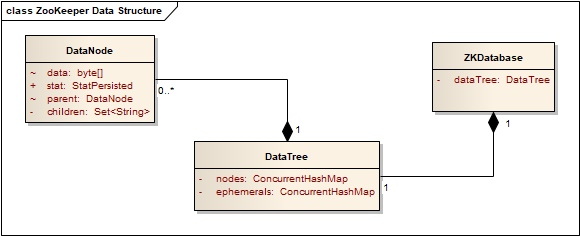
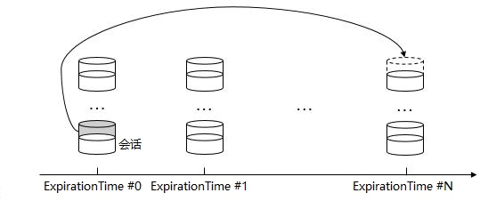

# 初探 ZooKeeper 技术内幕
by 阿福
转载自 <http://gitbook.cn/books/5aa69be40965940460c15e30/index.html>

[TOC]

## 前置说明

开始本文之前，读者应当具有 ZooKeeper 基础经验，或完成 《ZooKeeper 基本概念、使用方法、实践场景》 阅读。

本文使用 ZooKeeper 3.4.11 初探 ZooKeeper 的技术内幕，本文将重点阐述 ZooKeeper 实现分布式一致性的 ZAB（ZooKeeper Atomic Broadcasting） 算法，并介绍 ZooKeeper 的数据模型与存储、ZooKeeper 会话管理。

## 分布式一致性

“分布式” 是大型系统实现高性能、高可用所常用的架构手段，本章节将概述 “分布式一致性”的基本内容，以作为 ZAB 算法阐述的基础。

### 分布式一致性的基本概念

数据库系统的基础理论中，“事务”必须符合 ACID，即为：Atomicity 原子性、Consistency 一致性、Isolation 隔离性、Durability 持久性，其中：

1. Atomicity 原子性：“事务”必须 “全部成功”，或者 “全部失败”，不允许部分成功、部分失败；
2. Consistency 一致性：任何 “事务”必须保证数据库约束（主键、外键……）有效。

关于 “分布式一致性”，必须明确，“分布式一致性”的 “一致性”与 ACID 的 “一致性”并不相同，其更多蕴含了 ACID 中 “Atomicity 原子性”的含义。

通俗而言，分布式系统中，每一次 “读”都能获取到 “最后更新”的数据，即为 “分布式一致性”。

特别的，分布式系统中，数据通常以“副本”的形式存在于不同的节点，“分布式一致性”要求：通过任意节点的“数据副本”，都能够获取到“最后更新”的数据，即：对于每一次 “写”，所有节点的“数据副本”都必须完成更新。

### 分布式一致性类型

为了阐述“分布式一致性”的类型，假设以下场景：

- 存储系统：提供数据的“读”、“写”操作（通常认为是分布式的）；
- 客户端 A、B、C：通过“存储系统”进行数据的“读”、“写”，A、B、C 相互独立。

**强一致性（Strong Consistency）**

任何“写”操作完成，任意的“读”（无论客户端 A、B 或 C），都能够获得“写”操作所写入的数据。

**弱一致性（Weak Consistency）**

“写”操作完成，除非满足特定的条件，否则不能保证“读”将获得“写”操作所写入的数据。“写”操作完成到“分布式一致性”达成的时间段，称为“不一致时间窗”。

**最终一致性（Eventual Consistency）**

本质而言，“最终一致性”是一种特殊的“弱一致性”，但通常予以独立区分：如果数据没有新的“写”操作，最终，任意“读”操作将获得最新的值。若没有异常产生，“不一致时间窗”将具有确定的“上限”。

最终一致性的“变种”包括：

- 因果一致性 （Causal Consistency）：若客户端 A 将“写”操作“通知”到客户端 B，任意来自客户端 B 的“读”操作，都能够获取“写”操作所写入的数据（不保证客户端 C 的“读”操作）；

- “Read-your-writes”一致性（Read-your-writes Consistency）：若客户端 A 完成了“写”操作，任意来自客户端 A 的“读”操作，都能够获取“写”操作所写入的数据；

- 会话一致性（Session Consistency）：客户端 A 以“会话”的形式进行“存储系统”的“读”/“写”，相同的“会话”中，能够确保 Read-your-writes Consistency（若“会话”出现异常重建，将不保证）；

- 单调读一致性（Monotonic Read Consistency）：若客户端 A 通过“读”操作获取到数据特定“版本”的值，后续的“读”操作，将确保不会获取到“旧版本”值；

- 单调写一致性（Monotonic Write Consistency）：客户端 A 的“写”操作将“顺序地”执行。

## CAP 与 BASE

CAP，即为：**Consistency**、**Availability**、**Partition Tolerance**。

1. Consistency（一致性）
2. Availability（可用性）：每一次请求都能够得到响应，并且没有异常；
3. Partition Tolerance（分区容错性）：“分区”，即分布式系统中，由于网络原因，部分节点与其他节点网络中断，即形成“分区”，“分区容错性”要求，“分区”形成时，系统能够继续提供服务。

CAP 理论强调，分布式系统中，C、A、P 三个要素无法同时满足，仅能够实现其中任意两个。

然而，对于分布式系统而言，P（分区容错性）通常是最基本的要求，关于 C 和 A 必然做出权衡，最常见的方案即为 **BASE**，Basically Available、Soft state、Eventual consistency：

- **Basically Available（基本可用）**：未知故障出现时，允许损失部分可用性，例如：响应延时增加、部分功能不可用；
- **Soft State（弱状态）**：允许数据存在“中间状态”（例如：网络延时引起分布式不同节点间的数据同步延时），并认为“中间状态”不影响整体服务；
- **Eventual Consistency**（最终一致性）。

**BASE 的核心：不追求“强一致性”，允许结合业务特性，以适当的方式达成“最终一致性”。**

## ZAB - ZooKeeper Atomic Broadcasting

ZAB 是 ZooKeeper 的核心，是 ZooKeeper 实践 BASE 的精华，其主要负责：

1. Leader 选举
2. 数据同步
3. 事务广播
4. 崩溃恢复

ZAB 与 Paxos 算法的非常相似，但 ZAB 基于设计目标，引入了 FIFO 通信（借助 TCP）、全局事务 Id。限于篇幅，本文将不予以讨论。

### ZAB 系统模型 & 概念定义

ZAB 系统模型中，节点（peers）集合构成整个系统：

$$
\prod = \{ p_1,p_2,...,p_N \}
$$

关于节点：

1. 所有的节点都具有稳定的存储能力；
2. 任意节点之间都能够进行通信（消息发送 & 接收）；
3. 于整体系统运行期间，任意节点都有可能无限次地崩溃或恢复。

特别的，将节点集合 $\prod$ 的子集 $Q$ 称为 quorum，当且仅当 $|Q| > N / 2$。

ZAB 系统模型中，节点集合 $\prod$ 的主（primary）节点，负责将消息广播到其他所有的节点，并且：

1. 任意时间点，最多允许唯一的主节点；
2. 一旦主节点崩溃，新的主节点将被“选举”产生。

因此，系统运行，将获得主节点的“序列”：$p_1 p_2 … p_e … $ ，e 即表示 $p_e$ 作为主节点的“时期”（Epoch）。使用 $p_e ≺ p_{e'}$ 表示 $e < e'$ 。

ZAB 事务，即表示来自主节点广播的“状态变更”消息，表示为 $⟨v,z⟩$ ：

1. $v$ 表示新的状态；
2. $z$ 表示事务的唯一标示（ZxId，于 ZooKeeper 中，即为 ZxId）。

事务首先由主节点“提议”（Propose），当节点被明确地通知时，事务进行“提交”（Commit）。

### ZAB 关键特性

为了保证节点间的一致性，ZAB 必须具备若干关键特性。

首先，节点集合 $Π$ 的任意两个节点 $p_i$、$p_j$，两者间的通信，必须具备的特性包括：

1. Integrity（完整性）：若节点提交了事务 $⟨v,z⟩$ ，必定存在进行事务 $⟨v,z⟩$ 广播的节点；
2. Total Order（全局顺序性）：若节点依次提交了事务 $⟨v,z⟩$ 和 $⟨v′,z′⟩$，则任意提交了事务 $⟨v′,z′⟩$ 的节点，必须于 $⟨v′,z′⟩$ 提交前完成 $⟨v,z⟩$ 的提交；
3. Agreement：若节点 $p_i$ 提交了事务 $⟨v,z⟩$，节点 $p_j$ 提交了事务 $⟨v′,z′⟩$，则 $p_i$ 提交了 $⟨v′,z′⟩$ ，或者 $p_j$ 提交了 $⟨v,z⟩$。

此外，关于“主节点顺序性”（Primary Order），必须具备的特性包括：

1. 本地“主节点顺序性”（Local Primary Order）：若主节点依次广播了 $⟨v,z⟩$ 和 $⟨v′,z′⟩$，则完成事务 $⟨v′,z′⟩$ 提交的节点，必须于 $⟨v′,z′⟩$ 提交前完成 $⟨v,z⟩$ 的提交；
2. 全局“主节点顺序性”（Global Primary Order）：主节点 $p_i$ 广播了事务 $⟨v,z⟩$，主节点 $p_j$ 广播了事务 $⟨v′,z′⟩$，并且 $p_i ≺ p_j$，若节点提交了 $⟨v,z⟩$ 和 $⟨v′,z′⟩$，则 $⟨v,z⟩$ 的提交必须位于 $⟨v′,z′⟩$ 前；
3. 主节点完整性（Primary Integrity）：主节点 $p_e$ 广播了事务 $⟨v,z⟩$，若任意节点提交了事务 $⟨v′,z′⟩$，并且 $⟨v′,z′⟩$ 由 $p_{e′}$ 广播，$p_{e′} ≺ p_e$，则广播事务 $⟨v,z⟩$ 前，主节点 $p_e$ 必须完成 $⟨v′,z′⟩$ 提交。

### ZAB 算法

**ZAB 中，节点可能位于以下状态：**

- leading：主节点（亦称为 Leader），负责事务广播；
- following：节点作为 Follower；
- election：正在进行“主节点选举”。

ZAB 共计包括 4 个阶段，由节点依次执行：

- #0：主节点选举 （Leader Election），节点位于 election 状态时执行；
- #1：发现 （Discovery）；
- #2：同步 （Synchronization）：阶段 #1 与 #2 的意义即为实现节点之间一致的状态；
- #3：广播 （Broadcast）：若无故障产生，节点将最终停留于阶段 #3。本阶段，最多允许 1 个节点位于 leading 状态。

开始了解 ZAB 各个阶段之前，若干事项必须明确。首先，关于 ZAB 事务标示 $⟨e,c⟩$，$e$ 即为 epoch，$c$ 即为 epoch 内的计数。

**其次，ZAB 关于节点间消息类型的定义。**

- FOLLOWERINFO：阶段 #1，Follower 向 Leader 发送信息（acceptedEpoch）的消息类型；
- NEWEPOCH/ACKEPOCH：阶段 #1，Follower 与 Leader 关于 epoch 协商的消息类型；
- NEWLEADER/ACKNEWLEADER：阶段 #2，Follower 与 Leader 关于“Leader”确认的消息类型；
- PROPOSE/ACK/COMMIT：正常提供服务时，关于事务的消息类型。

**再次，关于节点需要持久化的数据：**

- history：节点事务日志；
- acceptedEpoch：最新 NEWEPOCH 消息的 epoch；
- currentEpoch：最新 NEWLEADER 消息的 epoch；
- lastZxid：事务日志中最新的 ZxId。

ZAB 算法假设：能够检测事务日志中的事务是否完成提交。

#### 阶段 #0，主节点选举（Leader election）

主节点选举，作为“选举”，所有的节点参与“投票”，“票数过半”（即获得 quorum 的“投票”）的节点即为主节点。

若节点 $p$ “投票”节点 $p′$，$p′$ 即成为 $p$ 的 prospective Leader，仅当进入阶段 #3，prospective Leader 才能成为主节点（对于节点 p，称为 Established Leader）。

若节点 $p$ “投票”节点 $p$ 自身，则进入 leading 状态；否则，进入 following 状态，成为 Follower。

需要说明：ZAB 协议没有限定“主节点选举算法”，ZooKeeper 实现中，使用了称为 ZooKeeper FLE（Fast Leader Election）的算法，限于篇幅，本文不予以展开讨论。

#### 阶段 #1，发现（Discovery）

本阶段目标：获取 quorum 中最新的事务日志，并建立新的 epoch。

Follower 伪代码如下：

```
Follow F：
    向 Leader L 发送 FOLLOWERINFO(F.acceptedEpoch) 消息
    upon 收到来自 Leader L 的 NEWEPOCH(e') 的消息 do
        if e' > F.acceptedEpoch then
            F.acceptedEpoch ← e'
            向 Leader L 发送 ACKEPOCH(F.currentEpoch, F.history, F.lastZxid) 消息
            goto 阶段 #2
        else if e' < F.acceptedEpoch then
            F.state ← election
            goto 阶段 #0
        end
    end
```

伪代码所示，节点 $p$ 与其 prospective Leader 建立连接，若其 prospective Leader 没有位于 leading 状态，将拒绝连接，节点 $p$ 将重新进入阶段 #0.

Leader 伪代码如下：

```
Leader L：
    upon FOLLOWERINFO(e) 消息 “已收到” 的 Follower 节点构成 quorum Q do
        生成 e': 确保 e' 大于全部 FOLLOWERINFO(e) 消息的 e
        向 Q 中的全部 Folower 发送 NEWEPOCH(e1) 消息
    end
    upon 收到 Q 中全部 Follower 发送的 ACKEPOCH 消息
        于 Q 中获取 Follower f，确保 Q 中其他任意的 Follower f‘
            f'.currentEpoch < f.currentEpoch
            或 (f'.currentEpoch = f.currentEpoch 且 f`.lastZxid ≤ f.lastZxid)
        L.history ← f.history
    end
```

#### 阶段 #2，同步（Synchronization）

本阶段目标：使用阶段 #0 获得的事务日志，于节点间实现数据同步。

Follower 伪代码如下：

```
Follower F：
    upon 收到来自 Leader L 的 NEWLEADER(e`, H) 消息 do
        if F.acceptedEpoch = e' then
            F.currentEpoch ← e'
            for <v,z> ∈ H 基于 zxid 排序 do
            end
            F.history ← H
            向 Leader L 发送 ACKNEWLEADER(e', H) 消息
        else
            F.state ← election
            goto 阶段 #0
        end
    end
    upon 收到来自 Leader L 的 COMIT 消息 do
        for 未完成事务 <v,z> ∈ F.history 基于 zxid 排序 do
            提交事务 <v,z>
        end
        goto 阶段 #3
    end
```

Leader 伪代码如下：

```
Leader L:
    向 Q 中的全部 Follower 发送消息 NEWLEADER(e', L.history)
    upon ACKNEWLEADER 消息 “已收到” 的 Follower 节点构成 quorum do
        向全部 Follower 发送 COMMIT 消息
        goto 阶段 #3
    end
```

伪代码所示，本阶段：

1. Leader 广播其事务日志；
2. 若 Leader 广播的事务日志比 Follower 自身事务日志“新”，则 Follower 确认；
3. 当 Leader 获得的确认的 Follower 节点达到 quorum，Leader 要求已确认的 Follower 提交事务。

阶段 #2 完成，Leader 正式确认。

#### 阶段 #3，广播（Broadcast）

本阶段，系统正常提供服务，当客户端提交“写”操作，Leader 广播事务，当获得 quorum 的确认，则提交事务。

同时，本阶段支持新的 Follower 加入。

Follower 伪代码如下：

```
```

Leader 伪代码如下：

```
```

附加说明，ZAB 于 Leader 和 Follower 建立“心跳机制”，出现以下情况，节点切换到 election 状态，重新进入阶段 #0：

1. 若 Leader 获得心跳的节点无法构成 quorum；
2. 若 Follower 无法获得 Leader 心跳。

## ZooKeeper 数据模型 & 存储

ZooKeeper 将 ZNode 作为基础的数据结构，本章节将阐述 ZooKeeper 数据模型、数据快照以及事务日志。

### ZNode 模型

ZooKeeper 使用 DataNode、DataTree、ZKDatabase 构建 ZNode 树状模型：


**DataNode**
DataNode 作为 ZNode 的基础单元，存储字节数组类型的数据、ZNode Stat、ACL 信息，以及 ZNode 父级 ZNode 的 DataNode 引用、子级 ZNode Path 集合。

**DataTree**
DataTree 使用 ConcurrentHashMap 保存全部的 DataNode，其中：ZNode Path 即为 Key。需要说明：“临时”（Ephemeral）ZNode 使用独立的 ConcurrentHashMap。

此外，DataTree 承载了 Watch 相关的数据。

**ZKDatabase**
ZKDatabase 承载了 DataTree，同时，负责：会话管理、数据快照以及事务日志。

### 数据快照

数据快照，顾名思义，ZooKeeper 将全量内存数据，落地于磁盘。

ZooKeeper 配置包含了 dataDir 配置项，默认情况，数据快照存储于 dataDir 中的 version-2 路径：

1. 日志文件以 snapshot 作为前缀；
2. 日志文件以 16 进制数作为后缀，即生成数据快照时，最新的 ZxId。

需要说明：version-2 的 2 代表了数据快照格式的版本（未来，若 ZooKeeper 进行数据快照格式的升级，路径名称即发生变化）。

#### 数据快照格式

ZooKeeper 内置了“数据快照格式化输出”工具，以查看日志文件 /data/svr/version-2/snapshot.7 作为示例：

```bash
java -cp zookeeper-3.4.11.jar:lib/log4j-1.2.16.jar:lib/slf4j-log4j12-1.6.1.jar:lib/slf4j-api-1.6.1.jar org.apache.zookeeper.server.SnapshotFormatter ~/zookeeper/svr/version-2/snapshot.7
```

格式化的数据快照内容示例：

```txt
ZNode Details (count=4):
----
/
  cZxid = 0x00000000000000
  ctime = Thu Jan 01 08:00:00 CST 1970
  mZxid = 0x00000000000000
  mtime = Thu Jan 01 08:00:00 CST 1970
  pZxid = 0x00000000000000
  cversion = 0
  dataVersion = 0
  aclVersion = 0
  ephemeralOwner = 0x00000000000000
  dataLength = 0
----
/zookeeper
  cZxid = 0x00000000000000
  ctime = Thu Jan 01 08:00:00 CST 1970
  mZxid = 0x00000000000000
  mtime = Thu Jan 01 08:00:00 CST 1970
  pZxid = 0x00000000000000
  cversion = 0
  dataVersion = 0
  aclVersion = 0
  ephemeralOwner = 0x00000000000000
  dataLength = 0
----
/zookeeper/quota
  cZxid = 0x00000000000000
  ctime = Thu Jan 01 08:00:00 CST 1970
  mZxid = 0x00000000000007
  mtime = Sat Mar 17 11:03:24 CST 2018
  pZxid = 0x00000000000000
  cversion = 0
  dataVersion = 6
  aclVersion = 0
  ephemeralOwner = 0x00000000000000
  dataLength = 1
----
Session Details (sid, timeout, ephemeralCount):
0x10015f04f210000, 30000, 0
```

格式化输出的数据快照包含了全部的 ZNode 及其 Stat，但不包含 ZNode 的数据内容。

#### 数据快照的生成

本质而言，数据快照的生成，即获取 ZKDatabase 的 DataTree 以及会话信息，序列化、生产 Checksum，最终落地文件。

ZooKeeper 允许配置两次数据快照生成之间的事务数 snapCount，但 snapCount 并不是严格约束，当且仅当以下条件满足时，生成数据快照：

> 上一次数据快照生成至今完成的事务数 > (snapCount + RANDOM(1, snapCount / 2))

此外，数据快照的生成、落地，全部由独立的线程完成，以最大可能地减少性能影响。

## 事务日志

ZooKeeper 配置包含了 dataDir 配置项，默认情况，事务日志存储于 dataDir 中的 version-2 路径：

1. 日志文件以 log 作为前缀；
2. 日志文件以 16 进制数作为后缀，即事务日志文件中第一条日志的 ZxId；
3. 日志文件固定 67108880 字节（64 M）。

需要说明：version-2 的 2 代表了事务日志格式版的本（未来，若 ZooKeeper 进行事务日志格式的升级，路径名称即发生变化）。

限于篇幅，针对事务日志的写入过程，本文将不以展开，但必须注意，为了提高事务日志“落地”的性能，ZooKeeper 采取了若干措施：

1. 日志文件所占用的磁盘空间是预分配的连续空间，67108880 字节，以“0”填充未使用部分；
2. ZooKeeper 允许用户选择，事务日志写入后，是否通过 fsync 系统调用，强制将操作系统缓冲区的数据写入磁盘。

### 事务日志格式

事务日志记录了全部的“事务”，每一条记录都包括：事务时间、SessionId、CxId、ZxId、事务类型、事务相关的数据，事务日志写入文件前将进行序列化，并同时写入 Checksum。

ZooKeeper 内置了“事务日志格式化输出”工具，以查看日志文件 /data/svr/version-2/log.1 作为示例：

```bash
java -cp zookeeper-3.4.11.jar:lib/log4j-1.2.16.jar:lib/slf4j-log4j12-1.6.1.jar:lib/slf4j-api-1.6.1.jar org.apache.zookeeper.server.LogFormatter /data/svr/version-2/log.1
```

格式化的事务日志内容示例（//... 内容为本文添加的注释）：

```txt
//
// 事务日志文件头（不显示事务日志文件头的 Magic 数）
//
ZooKeeper Transactional Log File with dbid 0 txnlog format version 2

//
// 会话创建日志，事务相关的数据即为：会话超时时间
//
3/17/18 8:39:38 AM CST session 0x10015a4042e0000 cxid 0x0 zxid 0x1 createSession 30000

//
// ZNode 创建日志，事务相关的数据：
//   ZNode Path
//   ZNode 数据内容：ASCII 编码，添加 # 作为前缀
//   ZNode ACL 信息
//   是否“临时”（Ephemeral）ZNode（T - 是，F - 否）
//   父级 ZNode 的 cversion（即 ZNode Stat 的子级 ZNode 版本号）
//
3/17/18 8:39:53 AM CST session 0x10015a4042e0000 cxid 0x1 zxid 0x2 create '/p0,#6430,v{s{31,s{'world,'anyone}}},F,1

//
// ZNode 数据写入日志，事务相关的数据：ZNode Path、ZNode 数据内容、父级 ZNode 的 cversion
//
3/17/18 8:39:58 AM CST session 0x10015a4042e0000 cxid 0x2 zxid 0x3 setData '/p0,#6431,1

//
// 会话关闭日志
//
3/17/18 8:40:01 AM CST session 0x10015a4042e0000 cxid 0x3 zxid 0x4 closeSession null

//
// 事务日志文件尾
//
EOF reached after 4 txns.
```

ZooKeeper 启动时，将使用数据快照和事务日志共同完成数据的初始化。

## ZooKeeper 会话管理

ZooKeeper 会话（Session），本质而言，即为客户端和服务端之间 TCP 连接的抽象。关于 ZooKeeper 会话相关的基础内容，请参阅[《ZooKeeper 基本概念、使用方法、实践场景》](http://gitbook.cn/gitchat/activity/5a792eaa7648740c4c24dcf5)，本章节，重点探讨会话的管理机制。

### 会话管理机制

ZooKeeper 会话，主要包含以下属性：

- sessionId：全局唯一的会话 Id；
- sessionTimeout：会话超时时间，必须说明：超时时间由 ZooKeeper 服务端最终确定；
- expirationTime：会话下一次超时的时间点；
- isClosing：会话是否关闭标记。

ZooKeeper 服务端，以“分桶”的形式进行会话管理，“桶”（bucket） 依据，即为 expirationTime，其计算方法：

```
expirationTime = ((currentTime + sessionTimeout) / expirationInterval + 1) * expirationInterval
```

代码所示的 expirationInterval 即为会话超时检查的时间间隔，以此实现：同一“桶”内的会话，超时时间点的间隔不超过会话超时检查的时间间隔。

当客户端向服务端发送请求（读、写、心跳），ZooKeeper 即进行一次“会话激活”，当且仅当会话的 isClosing 未被设置，即更新会话的 expirationTime，并移到新的“桶”。


“分桶”管理的优势，在于能够方便地明确需要进行超时检查的会话集合（即 expirationTime 最小的“桶”），以快速地进行超时检查以及会话清理。

会话的“心跳”，完全由 ZooKeeper 客户端发起，会话只能由服务端确认“过期”（会话超时后，客户端使用原有会话的 SessionId 与服务端重新建立连接）。

## 写在最后

ZooKeeper 的内容博大精深，本文仅从非常基础的层面进行了“粗线条”地概览。

期望通过本文，读者能够初步了解 ZooKeeper 技术内幕，特别是 ZooKeeper 背后蕴含的理念。

