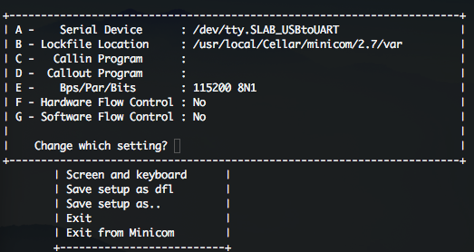

# openwrt-widora开发环境搭建
[TOC]

## 终端登录

### 通关串口登录

参见 <http://wiki.widora.cn/uart_console>

#### Mac通过串口登录

- 安装驱动 <http://www.silabs.com/documents/public/software/Mac_OSX_VCP_Driver.zip>
- 安装minicom `brew install minicom`
- 设置minicom `$ sudo minicom -s`
  
  - 择Serial port setup
  - A设置为对应的串口设备
  - E设置为115200 8N1
  - F设置为No
  - 返回上级
  - Save setup as dfl
  - Exit
  
  
  
- 登录终端 设置完成后自动已经登录，后续登录直接不带参数调用`$ minicom`

#### Windows通过串口登录

## 编译固件

代码下载：<https://github.com/widora/openwrt_widora>

## 升级固件

### 备份无线校准文件

sysupgrade

