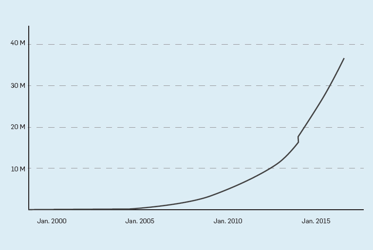
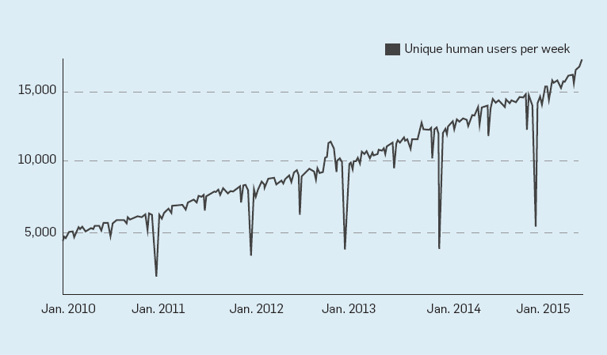
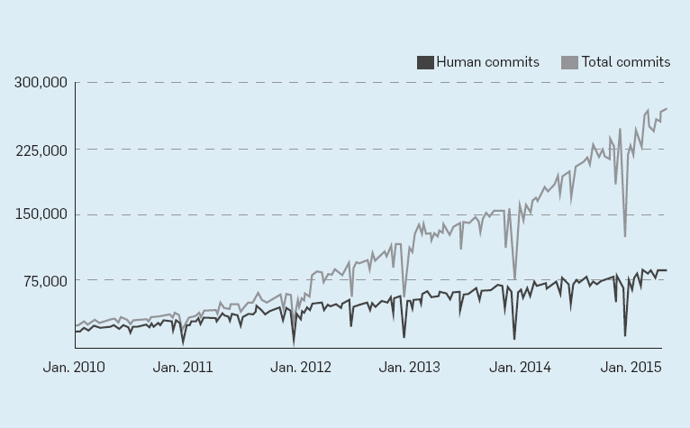
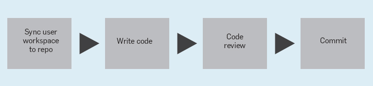
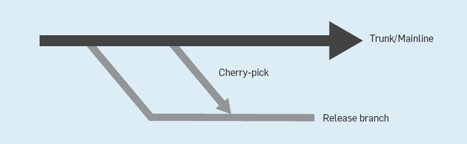
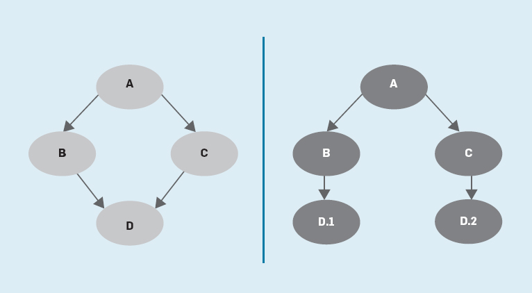

# 为什么谷歌将数十亿行代码储存在单一代码库中？

早期的谷歌员工做了一个决定：创建一个共享代码库，用它集中式资源控制系统来对其进行管理。在过去的16年中，这种共工作方式从来没有改变过，今天 谷歌将其海量的代码储存在单一的代码库中。与此同时，谷歌软件开发人员的数量一直在稳步增加，谷歌代码库的体积也在迅速增长（见图1）。结果就是，他们用 来托管代码库的技术也在这个过程中获得了显著的提高。

这篇文章讨论了这个代码库的规模，详细阐述了谷歌的订制大规模资源代码库，以及他们选择这种模式的原因。

谷歌使用了一个自有的版本控制系统，来对其大型代码库进行托管，让公司内大部分软件开发人员都可以对其进行查看和使用。这个集中式系统凝聚了谷歌大量软件开 发人员的心血。这篇文章汇总，我们提供了这个系统的产生背景，以及谷歌使用这个巨大repo的方式。我们还将讨论谷歌“**基于主干开发（TBD）**”的策略， 以及构建工作流程并且维持谷歌代码库健康度的支持系统，包括数据分析软件、代码清理和高效率代码评审。

谷歌的巨大软件代码库，被其全世界范围内95%的软件开发人员所使用，这个代码库完全符合“超大规模系统”的定义，让我们意识到单资源代码库模式也可以成功的实现规模化。

谷歌的代码库里面有着将近10亿个文件。在谷歌18年的发展过程中，它累计了接近3500个commit。这个代码库中有着86TB的数据，包括将近20亿行代码，900万个独立资源文件。

2014年，几乎每个礼拜，谷歌代码库汇总都有25万个文件夹中的接近1500万行代码会出现变化。Linux内核就是一个很好的例子：包含4万个文件夹、接近1500万行代码的大型开源软件代码库。

超过2.5万名谷歌软件开发人员都在共享这个代码库。在工作日的时候，他们会对代码库做出1.6万次变更，自动系统还会对代码库做出2.4万次变更。每一天 这个代码库都会收到数十亿次文件阅读请求，在高峰时段，它几乎每秒就要处理接近80万次请求，在工作日时，它平均每秒要处理接近50万次请求。大多数流量都来自谷歌分配的开发和测试系统。

图2为2010年1月到2015年7月间，人类工程师每周在主代码库中所作出的变更。

图3为在同一时期内，谷歌主代码库的总体变更数量。总变更数量包括人类工程师所作出的变更，以及自动化系统所作出的变更。两幅图中明显的跌落趋势是收到节假日员工数量的影响（例如圣诞节、元旦、感恩节和独立日等）。

2012年10月，谷歌的中央代码库添加了对Windows和Mac用户的支持（之前只支持Linux），此前的Windows和Mac代码库也整合到了主代码库中，因此在图2中可以看到2012那一年变更次数明显增多。在图一中也可以看到这个趋势。

从图中可以看到，在2012年以前，每周的变更率主要来自人类用户。而进入2012年之后，谷歌开始使用订制资源控制，用它来托管中央代码库，我们会在后面讨论这个问题。

这次转变之后，自动化变更数量开始提升。变更的主要驱动因素开始从人工向自动化系统转变。

管理如此大规模的大妈库，以及上面的各种活动，对于谷歌来说一直是一个巨大的挑战。虽然有着数年的实践，谷歌还是无法在市场上找到一个可用的，或是开源的版本控制系统，来支持这个规模如此大的单一代码库。于是谷歌自己开发了一个专利系统，来储存、更新以及管理这个代码库，谷歌给这个专利系统起了一个代 号：Piper。

## 背景

在讨论使用大规模代码库的利弊之前，我们需要先了解一下有关谷歌工具和工作流程的一些背景。

Piper和CitC。Piper储存着一个大型的代码库，它部署于谷歌的标准基础设施以上，这个基础设施以前是Bigtable，现在是Spanner。 Piper遍及谷歌全球范围内超过10个数据中心，依赖**Paxos**算法来保证其连贯性。这样的架构为谷歌的软件开发人员提供了高级别的保障，并且可以减少延迟，无论开发人员在哪里工作，都可以随时使用这些代码。另外，缓存和异步操作也大大减少了开发人员的延迟。这是一个非常重要的因素，因为要想使用谷歌基 于云端的工具链，开发人员必须要保持时刻在线。

谷歌曾以来一个主要的Perforce实例，它托管在一台机器上，与订制缓存基础设施一起，这个基础设施早在Piper发布10年之前就已经出现了。谷歌开发Piper的主要动力，就是因为代码库不断的扩大而出现的需求。

谷歌的源代码就是这家公司最宝贵的资产，因此安全因素是Piper设计过程中的重中之重。Piper支持文件层面的访问控制列表。谷歌代码库上的大多数内容 都对Piper用户可见；然而，一些重要的配置文件，或是包含商业机密的算法则被更严格的控制了起来。另外，在Piper中对文件进行读写操作还会被记录 在案。如果敏感数据被Piper意外修改，有问题的文件会被清除。读取日志允许管理人员在某个用户访问问题文件之前，对其进行移除。

在 Piper的工作流程中（图4），开发人员在对代码库上的文件作出改动以前，他们需要现在本地复制目标文件。这些文件会储存在开发人员所拥有的一个工作区 中。Piper的工作区就像是Apache Subversion中的工作副本、Git中的本地克隆或是Perforce中的client一样。

Piper代码库中的更新，会被转移到这样一个工作区中，然后合并入正在进行的工作。开发人员可以和同事分享工作区的快照，请求评审。工作区中的文件修改只有在经过了谷歌的代码评审程序之后，才能够提交到中央代码库中。

大多数开发人员都通过一个名叫Clients in the Cloud（CitC）的系统接入Piper的，这个系统集合了一个云存储后端和一个Linux-only FUSE文件系统。在文件系统中，工作区会以分类的方式展现在开发人员眼前，里面包括了他们在全Piper代码库之上所作出的改变。CitC支持代码浏览 和普通的Unix工具，无需在本地对状态进行克隆和同步。开发人员可以在任何地方对Piper代码库进行浏览和编辑，而且只有修改后的文件会储存在他们的 工作区中。这种架构意味着CitC工作区只需要消耗一小部分的储存空间（通常情况下工作区中只有不到10个文件），同时还可以让开发人员看到整个 Piper代码库。

CitC会将所有对文件进行的写入操作储存为快照，在需要的时候，开发人员可以将文件恢复到此前的状态。开发人员还可以对快照进行命名、修复和添加标签操作。

CitC 工作区可以运行在任何能够介入云储存系统的机器上，也就是说开发人员可以随时更换机器，工作进度不会受到干扰。另外，这个特性还允许开发人员看到彼此之间 的工作。将所有工作进度储存在云端，是谷歌工作流程中的一个重要元素。其他的一些工具也可以调用工作状态，例如基于云端的开发系统、自动化测试基础设施， 以及代码浏览、编辑和审核工具。

一些工作流程还能够使用CitC中未提交的代码，从而让开发人员可以更高效的使用大型代码库。例如，当开发 人员将代码发送出去以供审核的时候，开发人员可以使用自动提交选项，当代码作者和审核人员身处不同时区的时候，这个选项非常实用。当审核被标记为完成之 后，测试就会开始；如果通过测试，代码将会被提交到代码库，全程无需人工干预。谷歌的代码浏览工具CodeSearch支持使用CitC工作区进行简单的 编辑。

在浏览代码库的时候，开发人员可以通过点击一个按钮进入编辑模式，并且进行一些简单的编辑（例如修改拼写错误，或是改进某个命令）。之后，在无需离开代码浏览器的情况下，他们可以通过打开自动提交选项将修改发送给相应的审核人员。

Piper也可以脱离CitC进行使用。开发人员可以将Piper工作区储存在自己的本地设备中。Pier和Git还有一定程度的互通性。今天超过80%的Pier用户都在使用CitC，而且这个比例还在不断提升，因为CitC给这些开发人员提供了很多的好处。

Piper和CitC的存在，让使用单一大规模资源代码库变成了可能，非常适合用来接入谷歌的代码库。

基于主干开发（TBD）。在Piper资源代码库之上，谷歌践行了基于主干开发（TBD）的工作方式。大量的Piper用户将那些位于最上方，也就是最新的 拷贝版本成为主干。TBD和重要代码库一起构成了大规模代码库模式。在一次commit完成之后，新的代码就立刻对所有开发人员可见、可用。

TBD 对谷歌有益的原因，一部分在于它可以避免痛苦的合并过程，这个过程通常存在于基于枝干开发的过程。谷歌内部很少使用基于枝干开发的方式，而且对这种开发方 式的支持也不够好，尽管枝干通常被用来做Release工作。必须添加Release的错误修复和加强通常都是在主干上开发的，之后通过优选进入 Release分支（见下图）。

当新功能被开发出来，新的和就的代码路径会同时存在，通过使用条件旗标来控制。这个技术避免了对枝干开发的需要，让通过配置更新来开启和关闭功能变得更加简单，不再需要满二进制发布。虽然开发者也会面临一些额外的复杂性，但是避免了枝干开发所需要面临的合并问题。

这种工作方式通常被用在一些特别的项目代码上，而不是普遍的库代码，最终旗标会显示出那些可以删除的老旧代码。谷歌使用了类似的方式在不同的代码路径中搜寻 实时流量，以此来进行可以通过配置更新而开始的测试工作。例如A/B测试，它有着诸多功能，例如衡量代码的表现，或是在产品出现细微改变时用来测试用户参 与度。

谷歌工作流程。一些组优秀的手段和支持系统，需要避免在基于主干开发模式下不断的出现损坏，因为成千上万的工程师每天都要在大妈库里 提交成千上万次的改变。例如，谷歌拥有一个自动测试基础设施，它可以在每一次修改被提交到代码库之后，立刻开始重建所有受影响的附属文件。如果一个修改导 致了大规模的文件损坏，这个系统就会立刻自动开始撤销这次改变。为了减少错误代码出现的频率，高度可定制的谷歌”presubmit”基础设施会自动对改 变进行分析和测试，在通过测试之后，这个代码才会被提交到主代码库中。

谷歌文化的重要组成部分之一，就是鼓励开发人员控制代码质量，所有代 码在进入主代码库之前，都必须要经过审核。大多数开发人员都可以浏览这些代码，并且对其进行修改，但是他们必须完全保证对代码所作出的修改可以完全受控。 允许开发人员修改代码当然也会带来一些风险，如果他们对于代码并不是深度了解的话，有可能会软乱代码审核的过程。谷歌的代码库是树状布局的。每一个库都有 专门负责的人，他们负责判定代码修改是否可以生效。

修改生效之后，提交修改的人员会受到一份来自其他开发人员的详细的代码审核说明，他会在说明中判断修改质量，以及一个修改授权，每一个库的负责人会衡量本次修改对自己所负责库代码库的匹配程度。

代码评测人员会对代码的质量进行详细的评价，例如设计、功能、复杂程度、测试、命名、评价质量和代码风格等。谷歌也给所有开发人员提供了一份多语言的谷歌代码风格知道。谷歌还编写了一个代码审核工具，这个工具名为Critique，它可以对提交的改动进行自动化测试。

谷歌的数据分析系统（Tricorder）和预发布基础设施还会在谷歌代码审核工具内提供有关代码质量、测试项目和测试结果的数据。这些检查会定期进行，尤 其是改动被提交之后。Tricorder还能够寻找代码中的错误，并且给出修改意见。这些系统为代码测试过程提供了宝贵的数据，让谷歌的代码库维持着较高 的健康程度。

谷歌还有一个开发人员团队，他们会不定期的进行一次大规模的代码清理，从而不断提高代码库的健康程度。机型清理的开发人员通常 会将清理过程费城两个阶段。利用这种工作方式，他们首先会做出一个大型的反相兼容修改。在完成之后，他们会进行一次规模较小的修改，移除那些已经不再需要 的模式。谷歌开发了一个名为Rosie的工具，来对第一个阶段的代码清理和修改提供支持。

在Rosie的帮助下，开发人员可以创建大型补 丁。之后Rosie会将大补丁拆分为小补丁，并对它们进行独立测试，再讲他们发送到代码审核人员那里，在通过测试和审核之后，Rosie会自动提交修改。 Rosie会通过代码拥有者的信息来对等级进行分类，并且将补丁提交给负责相应领域的审核人员。

下图展示的是Rosie每个月所提交的修改数量。可见在谷歌大规模代码库中，Rosie扮演了非常重要的角色。

总体来看，谷歌开发了多个方式和工具来支持他们的大规模代码库，例如基于主干开发、源代码代码库Piper、工作区客户端CitC以及工作流程支持工具 Critique、CodeSearch、Tricorder和Rosie等。我们将在下面的内容中讨论这个模式的利与弊。

### 分析

在这个部分中，我们将展开讨论大规模数据库的利与弊。以及维持这个模式所需要的成本。

优势：为谷歌超大规模代码库提供支持，并且同时满足上万名使用者的需求是一个巨大的挑战，但是谷歌还是使用了这个模式，因为其拥有以下一些优点。

最主要的是，它支持：

- 统一的版本，真实单一数据源；

- 大范围的代码共享和重复使用；

- 简化的依赖关系管理；

- 原子级别更改；

- 大规模重构；

- 多团队间的协作；

- 灵活的团队界限及代码所有权；

- 代码的透明度及树状结构提供了绝对的团队命名空间。

单一代码库提供了统一的版本和真实单一数据源。开发人员不会有任何的困惑，不必考虑那个代码库托管着文件的官方版本。如果一个团队想要使用另一个团队的代码，它可以直接调取使用。谷歌的数据库里有大量的实用分类，大规模数据库给他们提供了大范围的代码共享和重复使用能力。

谷歌的开发系统让多库代码的共存变得更简单，简化了依赖关系管理。对某个项目的更改会触发其依赖代码的重建。由于所有代码都储存在同一个代码库内，因此谷歌只有一个真实数据源，他们无需考虑依赖关系的变更。

最重要的是，这个模式让谷歌避免了“钻石依赖”（下图）：当A依赖于B，B和C都依赖于D，但是B需要D.1版本，而C需要D.2版本。在大多数时候，在这 种情况下我们无法开发A。对于基础库D来说，要想在不导致任何损坏的情况下发布新版本，是一件非常困难的事情，因为它所有的caller都必须要同时更 新。当库caller被托管在不同的代码库时，更新就变得非常困难了。

在开源世界，依赖关系总是会被库更新所破坏，而寻找所有可以共同运行的库版本是一件非常困难的事情。更新依赖关系的版本对于开发人员来说也是一件头疼的事 情，而延迟更新则会产生代价非常高的技术债务。相比之下，谷歌的大规模树状数据源就非常方便简单了，当一个人在更新库的时候，所有受影响的依赖关系也会同 时改变。对于基础库的改变，会体现在依赖链条之中，最终的产品也依赖于这些库，无需进行独立的同步或整合过程。

能够做出原子级别的更改，也是大规模代码库模式的优势之一。开发人员可以通过一次连贯操作，就对代码库中成千上万的文件进行大规模更改，而且不会破坏任何结构或测试。

在谷歌的这个结构中，开发人员不用考虑代码库的边界。工程师们不用对多个代码库进行合并。团队之间的界限也非常灵活。当项目所有人改变的时候，立刻就能有其他人接受，因为所有人使用的代码都一样。这个环境让对代码库进行重构和整顿变得风场轻松。

大规模代码库的另一个好处就是，代码库的布局非常容易理解，因为它是以树状的形式组织的。每一个团队在主树上都有一个目录结构，他们可以优秀的作为项目自己 的名称。每一个源文件都可以拥有独一无二的身份——一个包含版本号的文件路径。在浏览代码库的时候，开发人员可以很轻易的了解任何一个文件在代码库中的作 用。

谷歌的这个代码库还在不断的进化当中。随着更复杂的代码的出现，许多专门的代码库维护人员正在不断对其进行管理。由于所有项目都储存在一个地方，代码库维护团队可以为整家公司完成这个工作，而无需个人员工开发和培养自己的工具、技术和专业代码。

将 所有源代码储存在一个代码库中，允许代码库管理人员有效的对谷歌的源代码进行分析和修改。Sefaster和ClangMR等工具也提高了谷歌源代码的转 换程度。大规模代码库可以捕捉所有的依赖关系信息。谷歌的工程师们可以自信的移除老旧的源代码，因为它不会对新的API造成任何影响。单一共享代码库大大 简化了谷歌的整个工作流程。

成本与损失。虽然大规模代码库有很多优点，但是使用这个模式也让谷歌放弃了一些东西。

这些成本与损失主要体现在下面这三个方面：

- 开发和执行都要付出工具方面的投资；

- 代码库错综复杂，例如存在不必要的依赖关系，并且提高了代码搜寻的难度；

- 维持代码健康所付出的投资和精力。

从 很多方面来看，维持大规模代码库只需要相对简单的工具，因为公司只有一个系统。然而，工具的规模必须要符合代码库的体积。例如，谷歌为Eclipse编写 了一个订制插件，一次来让它可以在IDE中与大规模代码库相互协作。谷歌的代码检索系统支持静态分析，在代码浏览工具中提供相互参照、为Emacs和 Vim等开发环境提供了丰富的IDE功能。这些工具都需要谷歌进行不断的投资，来维持谷歌不断膨胀的编码库。

除了工具制作和维护方面的投 资，谷歌还必须承担运行这些系统的投资，其中一些系统需要很高的计算能力。谷歌内部有很多开发人员工具，例如自动测试基础设施和大规模开发基础设施，这些 工具对于运行大规模代码库来说都是非常重要的因素。因此谷歌必须做好详细的计划，他们应该多长时间运行这些工具一次，以平衡执行成本，同时还要为开发人员 提供足够的数据支持。

大规模模式让开发人员可以更轻松的了解代码库的架构。然而，随着代码库的规模不断扩大，代码搜寻将会变得更加困难，常 规的工具已经无法满足需要。开发人员必须要拥有代码探索的能力，找到相关的库，学会如何使用他们，以及是谁写的这些代码。库作者也需要不时的查看有谁在使 用他们的API。这需要公司在代码搜寻和浏览工具上进行大规模的投资。

这个模式还要求团队之间在使用开源代码的时候加强相互之间的协作。谷 歌代码库的一个区域，是专门用来储存开源代码的。为了避免依赖关系之间的冲突，需要注意的是，在特定的时间内，只能有一个版本的开源项目存在。谷歌在维持 代码健康度这件事情上做出了大量的投资，以解决代码库过于复杂和依赖关系管理的问题。

例如用于自动探测和移除坏死代码的特殊工具，拆分大规模充足和自动分配代码审核的工具，自动标注API的工具等。虽然这些工具都是自动的，但是依然需要人工的参与，尤其是进行大规模代码更改的时候，必须要经过人工审核。

## 替代方案

随着Git等分散式版本控制系统（DVCS）的兴起，谷歌已经开始考虑放弃Piper，采用Git作为他们的主要版本控制系统。谷歌内的一个团队正在专注于 支持Git，这个系统现在整备谷歌的安卓和Chrome团队所使用。使用Git对于这些团队来说非常重要，因为他们有着外部合作伙伴，并且有开源协作的需 要。

Git社区建议开发人员使用更多以及规模更小的代码库。一个Git-clone的操作需要将所有内容复制到本地机器，这对于使用大规 模代码库的开发人员来说是不可能的事情。要想开始使用基于Git的资源托管服务，谷歌就必须将他们的代码库进行拆分，变成上千个独立的代码库。这样的重构 将会给谷歌开发人员带来企业文化和工作流程双方面的改变。例如谷歌的安卓代码库，就独立于他们的主代码库，被分成了超过800个独立的代码库。

鉴于谷歌从当前模式中已经获得了诸多好处，很明显他们并不会对自己的代码库进行拆分。因此他们很可能不会采用Git或是其他的DVCS服务。

谷歌资源团队现在主要关注的是其自建资源系统的可靠性、安全性。这个团队还在对一个名为Mercurial的服务进行实验，这是一个类似Git的DVCS。 他们的目标是要给Mercurial客户端添加规模化功能，让它支持谷歌庞大的代码库。如果成功的话，这会给谷歌的开发人员提供一种全新的工作方式，在保留大规模代码库的同时享受DVCS式的工作流程。

## 总结

谷歌于1999年选择了大规模资源管理战略，那时的谷歌代码库从CVS 迁移到了Perforce中。早期的谷歌工程师认为维持一个单一的代码库，要强于将代码库进行拆分，只不过那个时候他们并没有想到未来代码库的体积会变得 如此之大，也没想过需要作出大量的工具来维持代码库的正常运行。

在多年的发展当中，随着中央代码库的不断扩大，谷歌领导层曾经考虑过停止使用大规模模式。但是最终他们还是决定维持现有模式，因为这个模式有着自己的优势。

大规模源代码管理模式并不适合所有公司。但是对于谷歌这样有着公开和协作文化的组织来说，这是一个不错的选择。而对于大多数代码库都是私人代码库，或是团队之间需要相互隐藏代码的公司来说，就不用考虑这种模式了。

谷歌发现，通过一些投资，单一巨大资源管理模式可以成功的变成一个拥有超过10亿文件、3500万commit、以及上万名使用者使用的代码库。随着谷歌内 部和外部不断成长，规模越来越大，我们希望这篇文字的分析，以及对工作模式的描述可以为除谷歌之外的其他公司提供价值，让其他人也可以重新考虑代码库的组 织结构。

