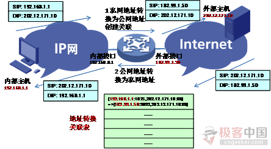
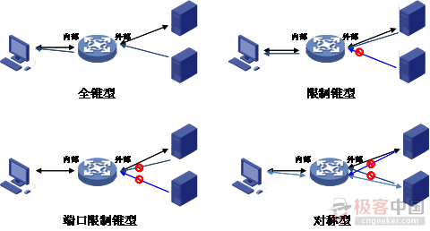
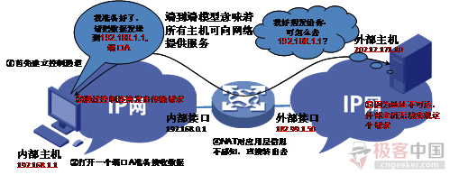
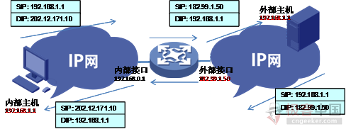

# P2P技术详解(一)：NAT详解——详细原理、P2P简介

[TOC]

## 1. IPv4协议和NAT的由来

今天，无数快乐的互联网用户在尽情享受Internet带来的乐趣。他们浏览新闻，搜索资料，下载软件，广交新朋，分享信息，甚至于足不出户获取一切日用所需。企业利用互联网发布信息，传递资料和订单，提供技术支持，完成日常办公。然而，Internet在给亿万用户带来便利的同时，自身却面临一个致命的问题：构建这个无所不能的Internet的基础IPv4协议已经不能再提供新的网络地址了。

2011年2月3日中国农历新年， IANA对外宣布：IPv4地址空间最后5个地址块已经被分配给下属的5个地区委员会。2011年4月15日，亚太区委员会APNIC对外宣布，除了个别保留地址外，本区域所有的IPv4地址基本耗尽。一时之间，IPv4地址作为一种濒危资源身价陡增，各大网络公司出巨资收购剩余的空闲地址。其实，IPv4地址不足问题已不是新问题，早在20年以前，IPv4地址即将耗尽的问题就已经摆在Internet先驱们面前。这不禁让我们想去了解，是什么技术使这一危机延缓了尽20年。

要找到问题的答案，让我们先来简略回顾一下IPv4协议。

IPv4即网际网协议第4版——Internet Protocol Version 4的缩写。IPv4定义一个跨越异种网络互连的超级网，它为每个网际网的节点分配全球唯一IP地址。如果我们把Internet比作一个邮政系统，那么IP地址的作用就等同于包含城市、街区、门牌编号在内的完整地址。IPv4使用32bits整数表达一个地址，地址最大范围就是232 约为43亿。以IP创始时期可被联网的设备来看，这样的一个空间已经很大，很难被短时间用完。然而，事实远远超出人们的设想，计算机网络在此后的几十年里迅速壮大，网络终端数量呈爆炸性增长。

更为糟糕的是，为了路由和管理方便，43亿的地址空间被按照不同前缀长度划分为A,B,C,D类地址网络和保留地址。其中，A类网络地址127段，每段包括主机地址约1678万个。B类网络地址16384段，每段包括65536个主机地址。

IANA向超大型企业/组织分配A类网络地址，一次一段。向中型企业或教育机构分配B类网络地址，一次一段。这样一种分配策略使得IP地址浪费很严重，很多被分配出去的地址没有真实被利用，地址消耗很快。以至于二十世纪90年代初，网络专家们意识到，这样大手大脚下去，IPv4地址很快就要耗光了。于是，人们开始考虑IPv4的替代方案，同时采取一系列的措施来减缓IPv4地址的消耗。正是在这样一个背景之下，本期的主角闪亮登场，它就是网络地址转换——NAT。

NAT是一项神奇的技术，说它神奇在于它的出现几乎使IPv4起死回生。在IPv4已经被认为行将结束历史使命之后近20年时间里，人们几乎忘了IPv4的地址空间即将耗尽这样一个事实——在新技术日新月异的时代，20年可算一段漫长的历史。更不用说，在NAT产生以后，网络终端的数量呈加速上升趋势，对IP地址的需求剧烈增加。此足见NAT技术之成功，影响之深远。

说它神奇，更因为NAT给IP网络模型带来了深远影响，其身影遍布网络每个角落。根据一份最近的研究报告，70%的P2P用户位于NAT网关以内。因为P2P主要运行在终端用户的个人电脑之上，这个数字意味着大多数PC通过NAT网关连接到Internet。如果加上2G和3G方式联网的智能手机等移动终端，在NAT网关之后的用户远远超过这个比例。

然而当我们求本溯源时却发现一个很奇怪的事实：NAT这一意义重大的技术，竟然没有公认的发明者。NAT第一个版本的RFC作者，只是整理归纳了已被广泛采用的技术。

## 2. NAT的工作模型和特点
### 2.1 NAT的概念模型
NAT名字很准确，网络地址转换，就是替换IP报文头部的地址信息。NAT通常部署在一个组织的网络出口位置，通过将内部网络IP地址替换为出口的IP地址提供公网可达性和上层协议的连接能力。那么，什么是内部网络IP地址？

RFC1918规定了三个保留地址段落：10.0.0.0-10.255.255.255；172.16.0.0-172.31.255.255；192.168.0.0-192.168.255.255。这三个范围分别处于A,B,C类的地址段，不向特定的用户分配，被IANA作为私有地址保留。这些地址可以在任何组织或企业内部使用，和其他Internet地址的区别就是，仅能在内部使用，不能作为全球路由地址。这就是说，出了组织的管理范围这些地址就不再有意义，无论是作为源地址，还是目的地址。对于一个封闭的组织，如果其网络不连接到Internet，就可以使用这些地址而不用向IANA提出申请，而在内部的路由管理和报文传递方式与其他网络没有差异。

对于有Internet访问需求而内部又使用私有地址的网络，就要在组织的出口位置部署NAT网关，在报文离开私网进入Internet时，将源IP替换为公网地址，通常是出口设备的接口地址。一个对外的访问请求在到达目标以后，表现为由本组织出口设备发起，因此被请求的服务端可将响应由Internet发回出口网关。出口网关再将目的地址替换为私网的源主机地址，发回内部。这样一次由私网主机向公网服务端的请求和响应就在通信两端均无感知的情况下完成了。依据这种模型，数量庞大的内网主机就不再需要公有IP地址了。

虽然实际过程远比这个复杂，但上面的描述概括了NAT处理报文的几个关键特点：
1. 网络被分为私网和公网两个部分，NAT网关设置在私网到公网的路由出口位置，双向流量必须都要经过NAT网关；
2. 网络访问只能先由私网侧发起，公网无法主动访问私网主机； 
3. NAT网关在两个访问方向上完成两次地址的转换或翻译，出方向做源信息替换，入方向做目的信息替换； 
4. NAT网关的存在对通信双方是保持透明的； 
5. NAT网关为了实现双向翻译的功能，需要维护一张关联表，把会话的信息保存下来。

随着后面对NAT的深入描述，读者会发现，这些特点是鲜明的，但又不是绝对的。其中第二个特点打破了IP协议架构中所有节点在通讯中的对等地位，这是NAT最大的弊端，为对等通讯带来了诸多问题，当然相应的克服手段也应运而生。事实上，第四点是NAT致力于达到的目标，但在很多情况下，NAT并没有做到，因为除了IP首部，上层通信协议经常在内部携带IP地址信息。这些我们稍后解释。

### 2.2 一对一的NAT
如果一个内部主机唯一占用一个公网IP，这种方式被称为一对一模型。此种方式下，转换上层协议就是不必要的，因为一个公网IP就能唯一对应一个内部主机。显然，这种方式对节约公网IP没有太大意义，主要是为了实现一些特殊的组网需求。比如用户希望隐藏内部主机的真实IP，或者实现两个IP地址重叠网络的通信。

### 2.3 一对多的NAT
NAT最典型的应用场景就如同图2描述的，一个组织网络，在出口位置部署NAT网关，所有对公网的访问表现为一台主机。这就是所谓的一对多模型。这种方式下，出口设备只占用一个由Internet服务提供商分配的公网IP地址。面对私网内部数量庞大的主机，如果NAT只进行IP地址的简单替换，就会产生一个问题：当有多个内部主机去访问同一个服务器时，从返回的信息不足以区分响应应该转发到哪个内部主机。此时，需要NAT设备根据传输层信息或其他上层协议去区分不同的会话，并且可能要对上层协议的标识进行转换，比如TCP或UDP端口号。这样NAT网关就可以将不同的内部连接访问映射到同一公网IP的不同传输层端口，通过这种方式实现公网IP的复用和解复用。这种方式也被称为端口转换PAT、NAPT或IP伪装，但更多时候直接被称为NAT，因为它是最典型的一种应用模式。

### 2.4 按照NAT端口映射方式分类
在一对多模型中，按照端口转换的工作方式不同，又可以进行更进一步的划分。为描述方便，以下将IP和端口标记为(nAddr:nPort)，其中n代表主机或NAT网关的不同角色。

- **全锥形NAT**
  其特点为：一旦内部主机端口对(iAddr:iPort)被NAT网关映射到(eAddr:ePort)，所有后续的(iAddr:iPort)报文都会被转换为(eAddr:ePort)；任何一个外部主机发送到(eAddr:ePort)的报文将会被转换后发到(iAddr:iPort)。

- **限制锥形NAT**
  其特点为：一旦内部主机端口对(iAddr:iPort)被映射到(eAddr:ePort)，所有后续的(iAddr:iPort)报文都会被转换为(eAddr:ePort)；只有 (iAddr:iPort)向特定的外部主机hAddr发送过数据，主机hAddr从任意端口发送到(eAddr:ePort)的报文将会被转发到(iAddr:iPort)。

- **端口限制锥形NAT**
  其特点为：一旦内部主机端口对(iAddr:iPort)被映射到(eAddr:ePort)，所有后续的(iAddr:iPort)报文都会被转换为(eAddr:ePort)；只有(iAddr:iPort)向特定的外部主机端口对(hAddr:hPort)发送过数据，由 (hAddr:hPort)发送到(eAddr:ePort)的报文将会被转发到(iAddr:iPort)。

- **对称型NAT**
  其特点为：NAT网关会把内部主机“地址端口对”和外部主机“地址端口对”完全相同的报文看作一个连接，在网关上创建一个公网“地址端口对”映射进行转换，只有收到报文的外部主机从对应的端口对发送回应的报文，才能被转换。即使内部主机使用之前用过的地址端口对去连接不同外部主机(或端口)时，NAT网关也会建立新的映射关系。

事实上，这些术语的引入是很多混淆的起源。现实中的很多NAT设备是将这些转换方式混合在一起工作的，而不单单使用一种，所以这些术语只适合描述一种工作方式，而不是一个设备。比如，很多NAT设备对内部发出的连接使用对称型NAT方式，而同时支持静态的端口映射，后者可以被看作是全锥型NAT方式。而有些情况下，NAT设备的一个公网地址和端口可以同时映射到内部几个服务器上以实现负载分担，比如一个对外提供WEB服务器的站点可能是有成百上千个服务器在提供HTTP服务，但是对外却表现为一个或少数几个IP地址。

## 3. NAT的限制与解决方案
### 3.1 IP端到端服务模型
IP协议的一个重要贡献是把世界变得平等。在理论上，具有IP地址的每个站点在协议层面有相当的获取服务和提供服务的能力，不同的IP地址之间没有差异。人们熟知的服务器和客户机实际是在应用协议层上的角色区分，而在网络层和传输层没有差异。一个具有IP地址的主机既可以是客户机，也可以是服务器，大部分情况下，既是客户机，也是服务器。端到端对等看起来是很平常的事情，而意义并不寻常。但在以往的技术中，很多协议体系下的网络限定了终端的能力。正是IP的这个开放性，使得TCP/IP协议族可以提供丰富的功能，为应用实现提供了广阔平台。因为所有的IP主机都可以服务器的形式出现，所以通讯设计可以更加灵活。使用UNIX/LINUX的系统充分利用了这个特性，使得任何一个主机都可以建立自己的HTTP、SMTP、POP3、DNS、DHCP等服务。与此同时，很多应用也是把客户端和服务器的角色组合起来完成功能。例如在VoIP应用中，用户端向注册服务器登录自己的IP地址和端口信息过程中，主机是客户端；而在呼叫到达时，呼叫处理服务器向用户端发送呼叫请求时，用户端实际工作在服务器模式下。在语音媒体流信道建立过程后，通讯双向发送语音数据，发送端是客户模式，接收端是服务器模式。而在P2P的应用中，一个用户的主机既为下载的客户，同时也向其他客户提供数据，是一种C/S混合的模型。上层应用之所以能这样设计，是因为IP协议栈定义了这样的能力。试想一下，如果IP提供的能力不对等，那么每个通信会话都只能是单方向发起的，这会极大限制通信的能力。细心的读者会发现，前面介绍NAT的一个特性正是这样一种限制。没错，NAT最大的弊端正在于此——破坏了IP端到端通信的能力。

### 3.2 NAT的弊端
NAT在解决IPv4地址短缺问题上，并非没有副作用，其实存在很多问题。

**首先，NAT使IP会话的保持时效变短**。因为一个会话建立后会在NAT设备上建立一个关联表，在会话静默的这段时间，NAT网关会进行老化操作。这是任何一个NAT网关必须做的事情，因为IP和端口资源有限，通信的需求无限，所以必须在会话结束后回收资源。通常TCP会话通过协商的方式主动关闭连接，NAT网关可以跟踪这些报文，但总是存在例外的情况，要依赖自己的定时器去回收资源。而基于UDP的通信协议很难确定何时通信结束，所以NAT网关主要依赖超时机制回收外部端口。通过定时器老化回收会带来一个问题，如果应用需要维持连接的时间大于NAT网关的设置，通信就会意外中断。因为网关回收相关转换表资源以后，新的数据到达时就找不到相关的转换信息，必须建立新的连接。当这个新数据是由公网侧向私网侧发送时，就会发生无法触发新连接建立，也不能通知到私网侧的主机去重建连接的情况。这时候通信就会中断，不能自动恢复。即使新数据是从私网侧发向公网侧，因为重建的会话表往往使用不同于之前的公网IP和端口地址，公网侧主机也无法对应到之前的通信上，导致用户可感知的连接中断。NAT网关要把回收空闲连接的时间设置到不发生持续的资源流失，又维持大部分连接不被意外中断，是一件比较有难度的事情。在NAT已经普及化的时代，很多应用协议的设计者已经考虑到了这种情况，所以一般会设置一个连接保活的机制，即在一段时间没有数据需要发送时，主动发送一个NAT能感知到而又没有实际数据的保活消息，这么做的主要目的就是重置NAT的会话定时器。

**其次，NAT在实现上将多个内部主机发出的连接复用到一个IP上，这就使依赖IP进行主机跟踪的机制都失效了**。如网络管理中需要的基于网络流量分析的应用无法跟踪到终端用户与流量的具体行为的关系。基于用户行为的日志分析也变得困难，因为一个IP被很多用户共享，如果存在恶意的用户行为，很难定位到发起连接的那个主机。即便有一些机制提供了在NAT网关上进行连接跟踪的方法，但是把这种变换关系接续起来也困难重重。基于IP的用户授权不再可靠，因为拥有一个IP的不等于一个用户或主机。一个服务器也不能简单把同一IP的访问视作同一主机发起的，不能进行关联。有些服务器设置有连接限制，同一时刻只接纳来自一个IP的有限访问(有时是仅一个访问)，这会造成不同用户之间的服务抢占和排队。有时服务器端这样做是出于DOS攻击防护的考虑，因为一个用户正常情况下不应该建立大量的连接请求，过度使用服务资源被理解为攻击行为。但是这在NAT存在时不能简单按照连接数判断。总之，因为NAT隐蔽了通信的一端，把简单的事情复杂化了。

我们来深入理解NAT一下对IP端到端模型的破坏力。NAT通过修改IP首部的信息变换通信的地址。但是在这个转换过程中只能基于一个会话单位。当一个应用需要保持多个双向连接时，麻烦就很大。NAT不能理解多个会话之间的关联性，无法保证转换符合应用需要的规则。当NAT网关拥有多个公有IP地址时，一组关联会话可能被分配到不同的公网地址，这通常是服务器端无法接受的。更为严重的是，当公网侧的主机要主动向私网侧发送数据时，NAT网关没有转换这个连接需要的关联表，这个数据包无法到达私网侧的主机。这些反方向发送数据的连接总有应用协议的约定或在初始建立的会话中进行过协商。但是因为NAT工作在网络层和传输层，无法理解应用层协议的行为，对这些信息是无知的。NAT希望自己对通信双方是透明的，但是在这些情况下这是一种奢望。

此外，NAT工作机制依赖于修改IP包头的信息，这会妨碍一些安全协议的工作。因为NAT篡改了IP地址、传输层端口号和校验和，这会导致认证协议彻底不能工作，因为认证目的就是要保证这些信息在传输过程中没有变化。对于一些隧道协议，NAT的存在也导致了额外的问题，因为隧道协议通常用外层地址标识隧道实体，穿过NAT的隧道会有IP复用关系，在另一端需要小心处理。ICMP是一种网络控制协议，它的工作原理也是在两个主机之间传递差错和控制消息，因为IP的对应关系被重新映射，ICMP也要进行复用和解复用处理，很多情况下因为ICMP报文载荷无法提供足够的信息，解复用会失败。IP分片机制是在信息源端或网络路径上，需要发送的IP报文尺寸大于路径实际能承载最大尺寸时，IP协议层会将一个报文分成多个片断发送，然后在接收端重组这些片断恢复原始报文。IP这样的分片机制会导致传输层的信息只包括在第一个分片中，NAT难以识别后续分片与关联表的对应关系，因此需要特殊处理。

### 3.3 NAT穿越技术
前面解释了NAT的弊端，为了解决IP端到端应用在NAT环境下遇到的问题，网络协议的设计者们创造了各种武器来进行应对。但遗憾的是，这里每一种方法都不完美，还需要在内部主机、应用程序或者NAT网关上增加额外的处理。

- **应用层网关**
  应用层网关(ALG)是解决NAT对应用层协议无感知的一个最常用方法，已经被NAT设备厂商广泛采用，成为NAT设备的一个必需功能。因为NAT不感知应用协议，所以有必要额外为每个应用协议定制协议分析功能，这样NAT网关就能理解并支持特定的协议。ALG与NAT形成互动关系，在一个NAT网关检测到新的连接请求时，需要判断是否为已知的应用类型，这通常是基于连接的传输层端口信息来识别的。在识别为已知应用时，再调用相应功能对报文的深层内容进行检查，当发现任何形式表达的IP地址和端口时，将会把这些信息同步转换，并且为这个新连接创建一个附加的转换表项。这样，当报文到达公网侧的目的主机时，应用层协议中携带的信息就是NAT网关提供的地址和端口。一旦公网侧主机开始发送数据或建立连接到此端口，NAT网关就可以根据关联表信息进行转换，再把数据转发到私网侧的主机。很多应用层协议实现不限于一个初始连接(通常为信令或控制通道)加一个数据连接，可能是一个初始连接对应很多后续的新连接。比较特别的协议，在一次协商中会产生一组相关连接，比如RTP/RTCP协议规定，一个RTP通道建立后占用连续的两个端口，一个服务于数据，另一个服务于控制消息。此时，就需要ALG分配连续的端口为应用服务。ALG能成功解决大部分协议的NAT穿越需求，但是这个方法也有很大的限制。因为应用协议的数量非常多而且在不断发展变化之中，添加到设备中的ALG功能都是为特定协议的特定规范版本而开发的，协议的创新和演进要求NAT设备制造商必须跟踪这些协议的最近标准，同时兼容旧标准。尽管有如Linux这种开放平台允许动态加载新的ALG特性，但是管理成本仍然很高，网络维护人员也不能随时了解用户都需要什么应用。因此为每个应用协议开发ALG代码并跟踪最新标准是不可行的，ALG只能解决用户最常用的需求。此外，出于安全性需要，有些应用类型报文从源端发出就已经加密，这种报文在网络中间无法进行分析，所以ALG无能为力。

- **探针技术STUN和TURN**
  所谓探针技术，是通过在所有参与通信的实体上安装探测插件，以检测网络中是否存在NAT网关，并对不同NAT模型实施不同穿越方法的一种技术。STUN服务器被部署在公网上，用于接收来自通信实体的探测请求，服务器会记录收到请求的报文地址和端口，并填写到回送的响应报文中。客户端根据接收到的响应消息中记录的地址和端口与本地选择的地址和端口进行比较，就能识别出是否存在NAT网关。如果存在NAT网关，客户端会使用之前的地址和端口向服务器的另外一个IP发起请求，重复前面的探测。然后再比较两次响应返回的结果判断出NAT工作的模式。由前述的一对多转换模型得知，除对称型NAT以外的模型，NAT网关对内部主机地址端口的映射都是相对固定的，所以比较容易实现NAT穿越。而对称型NAT为每个连接提供一个映射，使得转换后的公网地址和端口对不可预测。此时TURN可以与STUN绑定提供穿越NAT的服务，即在公网服务器上提供一个“地址端口对”，所有此“地址端口对”接收到的数据会经由探测建立的连接转发到内网主机上。TURN分配的这个映射“地址端口对”会通过STUN响应发给内部主机，后者将此信息放入建立连接的信令中通知通信的对端。这种探针技术是一种通用方法，不用在NAT设备上为每种应用协议开发功能，相对于ALG方式有一定普遍性。但是TURN中继服务会成为通信瓶颈。而且在客户端中增加探针功能要求每个应用都要增加代码才能支持。

- **中间件技术**
  这也是一种通过开发通用方法解决NAT穿越问题的努力。与前者不同之处是，NAT网关是这一解决方案的参与者。与ALG的不同在于，客户端会参与网关公网映射信息的维护，此时NAT网关只要理解客户端的请求并按照要求去分配转换表，不需要自己去分析客户端的应用层数据。其中UPnP就是这样一种方法。UPnP中文全称为通用即插即用，是一个通用的网络终端与网关的通信协议，具备信息发布和管理控制的能力。其中，网关映射请求可以为客户动态添加映射表项。此时，NAT不再需要理解应用层携带的信息，只转换IP地址和端口信息。而客户端通过控制消息或信令发到公网侧的信息中，直接携带公网映射的IP地址和端口，接收端可以按照此信息建立数据连接。NAT网关在收到数据或连接请求时，按照UPnP建立的表项只转换地址和端口信息，不关心内容，再将数据转发到内网。这种方案需要网关、内部主机和应用程序都支持UPnP技术，且组网允许内部主机和NAT网关之间可以直接交换UPnP信令才能实施。

- **中继代理技术**
  准确说它不是NAT穿越技术，而是NAT旁路技术。简单说，就是在NAT网关所在的位置旁边放置一个应用服务器，这个服务器在内部网络和外部公网分别有自己的网络连接。客户端特定的应用产生网络请求时，将定向发送到应用代理服务器。应用代理服务器根据代理协议解析客户端的请求，再从服务器的公网侧发起一个新的请求，把客户端请求的内容中继到外部网络上，返回的相应反方向中继。这项技术和ALG有很大的相似性，它要求为每个应用类型部署中继代理业务，中间服务器要理解这些请求。

- **特定协议的自穿越技术**
  在所有方法中最复杂也最可靠的就是自己解决自己的问题。比如IKE和IPsec技术，在设计时就考虑了到如何穿越NAT的问题。因为这个协议是一个自加密的协议并且具有报文防修改的鉴别能力，其他通用方法爱莫能助。因为实际应用的NAT网关基本都是NAPT方式，所有通过传输层协议承载的报文可以顺利通过NAT。IKE和IPsec采用的方案就是用UDP在报文外面再加一层封装，而内部的报文就不再受到影响。IKE中还专门增加了NAT网关是否存在的检查能力以及绕开NAT网关检测IKE协议的方法。

## 4. NAT的应用和实现
### 4.1 NAT的应用
NAT在当代Internet中被广泛采用，小至家庭网关，大到企业广域网出口甚至运营商业务网络出口。其实NAT在用户身边随处可见，一般家庭宽带接入的ADSL Modem和SOHO路由器都内置了NAT功能，WindowsXP支持网络连接共享，一个用户连接到公网可能会经过多层NAT而对此一无所知。很多企业也为节约IP费用采用NAT接入Internet，但是相比家庭用户有更复杂的需求。

- **NAT多实例应用**
  在VPN网络中，多实例路由意味着一个物理拓扑上承载多个逻辑拓扑，网络终端被分配到相互隔离的逻辑拓扑中，彼此之间没有路由的通路。但在访问Internet或者一些关键服务器资源时，被隔离的网络之间又存在共享资源的需求。NAT的多实例实现就是跨越这种逻辑拓扑的方法，把一个空间的网络地址映射到另一个空间。

- **NAT的高可靠性组网**
  提高网络可靠性是一个广泛的需求，NAT作为私网到公网的关键路径自然也需要高可靠性。当一个设备提供多个公网接口时，在多接口上部署NAT可以提供更高带宽和多ISP就近访问的能力。但是，当部署多个出口时，访问的流量可能会从不匹配的接口返回，这就要求NAT方案有良好的路由规划和部署合适的策略保证这种流量能够正确处理。在多个物理设备承担NAT功能时，不同设备之间的信息备份和流量分担也是一个组网难题。

- **同时转换源和目的地址的应用**
前面我们介绍的所有NAT应用中，由内网向外网访问过程中，都是将源地址进行转换而目的地址保持不变，报文反方向进入时则处理目的地址。但有一些特殊应用需要在由内向外的IP通路上，替换目的IP地址。通常，这种应用会同时替换源地址和目的地址，在经过NAT网关以后完成两次地址转换。当两个均规划使用私属IP地址范围的网络进行合并时，终端用户都不想调整自己的IP地址方案，又希望开放一些网络资源给彼此访问。这时就可以通过NAT的两次地址转换来解决路由和地址规划无法解决的问题。

4.2 NAT的设备实现

NAT作为一个IP层业务特性，在产品实现中与防火墙、会话管理等特性有紧密联系，这是因为NAT判断一个进入设备的报文是否需要NAT处理，判断报文是否为一个新的连接，都需要通过匹配访问控制列表规则和查询会话关联表进行判断。为了满足不同应用场景的NAT需求， NAT的管理界面可提供用户多种配置策略。按照NAT的具体工作方式，又可以做如下分类。

- **静态一对一地址映射**
  这种工作方式下，NAT把一个私网地址和一个公网地址做静态关联，在从内而外的方向，将源IP匹配的私网IP替换为公网IP，反方向则将目的IP匹配公网IP的报文替换为私网IP。网络层以上的部分不进行替换处理，只修正校验和。

- **静态多对多地址映射**
  这种方式与上一种类似，只是把一段私网地址映射到一段公网地址。工作机制与前述的方式没有差别，只是简化配置工作量。

- **动态端口映射**
  这是最基本的工作方式，即前面多次介绍的将一段内网地址动态翻译为一个或多个公网IP，同时对传输层端口或其他上层协议信息进行转换，以实现IP复用。对由内而外的报文，替换源地址和端口，反向报文替换目的地址和端口。仅以连接公网的接口IP作为NAT转换的公网地址时，这种配置最简化，又被称为EasyIP。当以一段公网IP地址作为NAT转换地址时，需要配置一个地址池，NAT会自动在地址池中选择使用公网IP。

- **动态地址映射(no-pat)**
  这是介于静态多对多地址映射和动态端口映射方式之间的一种工作机制。当有一个私网向公网侧访问到达NAT网关时，NAT网关会检查这个私网IP是否已经有关联的公网IP映射。如果已经存在，则按照转换表直接替换IP，不修改上层协议。如果不存在关联表项，则在空闲的公网IP池中占用一个IP，并写入关联表中，以后按照这个关联关系进行地址转换。当这个私网主机发起的所有对外访问均关闭或超时后，回收公网IP。这种方式可以理解为一组内网主机抢占式地共享一个公网IP地址池。当公网IP地址池用完以后，新连接将无法建立。

- **静态端口映射**
通过静态配置，把一个固定的私网IP地址和端口关联到一个公网地址和端口上。这种方式等同于前面介绍过的全锥模式，但是不需要内网主机首先发出报文。这种方式适用于在NAT网关上把一个知名服务（如HTTP）映射到一个内部主机上，也称为port forwarding。

- **应用层网关(ALG)**
  在所有NAT产品实现中，ALG是一个必需的功能组件。但在不同实现中，有些产品可以动态加载不同的ALG模块，有些产品可以提供ALG开关控制，有些则不提供任何用户接口。ALG解析上层应用协议的内容，并且根据需要修改IP和端口相关信息，创建和维护附加的关联表项。

- **NAT转换关联表**
  无论哪一种NAT工作方式，都要用到地址转换关联表，在不同产品的实现中，这个关联表的存储结构和在IP转发中调用的方式有很大不同。关联表中会记录源IP、目的IP、连接协议类型、传输层源端口、目的端口，以及转换后的源IP、源端口，目的IP、目的端口信息，这里的源和目的都是对应于从内网到外网的访问方向。依据NAT具体工作方式，这些信息可能全部填充，也可能部分填充。例如只按照IP做静态映射的方式，就不需要填入任何端口相关信息；对于静态端口映射，则只填入源相关的内容，而目的端的信息为空。

## 5. 后IPv4时代的NAT
NAT是为延缓IPv4地址耗尽而推出的技术。毫无疑问，它已经出色完成了自己的历史使命，IPv4比预期走得更远。作为继任者的IPv6吸取了IPv4的教训，被赋予充足地址空间的同时在各个方面做了优化——安全、高效、简洁。但是IPv6无法平滑地取代IPv4，导致IP升级步伐缓慢。尽管网络协议的分层设计很清晰，大量应用层协议和互联网软件中仍内嵌了IPv4地址的处理，要Internet全网升级到IPv6，必须先完成应用的改造。因为NAT和它的穿越技术结合能够满足大部分用户的需求，所以IPv6时代被不断推迟。

随着IPv4地址的濒临耗尽，再经济的模式也无以为继，IPv4必须退出历史舞台。人们自然会认为，NAT作为IPv4的超级补丁技术使命已经完结。实际情况是，IPv4向IPv6过渡的阶段，NAT仍然是一项必不可少的技术手段。因为Internet无法在一日之内完成全网升级，必然是局部升级，逐渐替换。在两套协议并存的时期，用户和服务资源分布在不同网络之间，跨网访问的需求必须得到满足。这正是NAT所擅长的领域，地址替换，因此NAT-PT应运而生。由于IPv4和IPv6之间的差异，NAT要做的事比以往更复杂，有更多的限制和细节。

此外，IETF也在制定纯IPv6网络使用的NAT规范。虽然人们还看不到这种应用的强烈需求，但是NAT仍有其独特的作用，比如隐藏内部网络的地址，实现重叠地址网络的合并等。

毫不夸张地说，正是有了NAT，以IPv4为基础的Internet才能容纳数十亿的用户终端，成就今日之辉煌。IPv4已至日暮西山，IPv6的黎明尚未来临，Internet比任何时刻都更依赖NAT这项过渡技术。NAT的历史再次证明，翻天覆地的划时代进步不一定有市场，抱残守缺的修修补补未必不会成功。在世代更替之时让我们走近NAT，领略IP领域更多细微但不高深的知识，理解NAT就是理解变换万千的应用世界。

