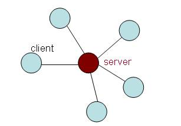
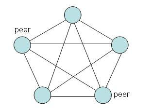
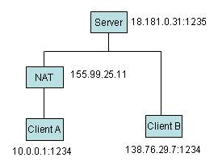
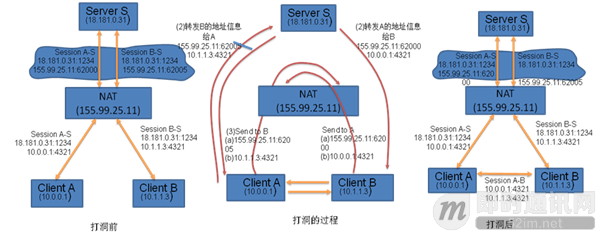
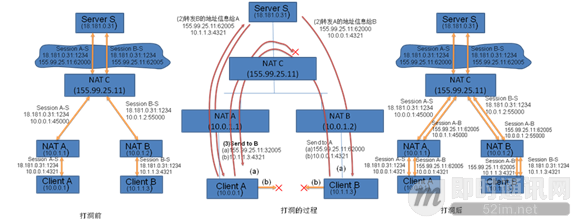
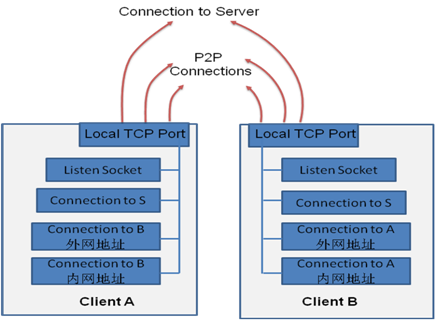

# P2P技术详解(二)：P2P中的NAT穿越(打洞)方案详解
[TOC]

## 1、内容概述
P2P即点对点通信，或称为对等联网，与传统的服务器客户端模式（如下图“P2P结构模型”所示）有着明显的区别，在即时通讯方案中应用广泛（比如IM应用中的实时音视频通信、实时文件传输甚至文字聊天等）。

P2P可以是一种通信模式、一种逻辑网络模型、一种技术、甚至一种理念。在P2P网络中（如右图所示），所有通信节点的地位都是对等的，每个节点都扮演着客户机和服务器双重角色，节点之间通过直接通信实现文件信息、处理器运算能力、存储空间等资源的共享。P2P网络具有分散性、可扩展性、健壮性等特点，这使得P2P技术在信息共享、即时通讯、协同工作、分布式计算、网络存储等领域都有广阔的应用。

NAT技术和P2P技术作为经典的两项网络技术，在现在的网络上有着广泛的应用，P2P主机位于NAT网关后面的情况屡见不鲜。NAT技术虽然在一定程度上解决了IPv4地址短缺的问题，在构建防火墙、保证网络安全方面都发挥了一定的作用，却破坏了端到端的网络通信。NAT阻碍主机进行P2P通信的主要原因是NAT不允许外网主机主动访问内网主机，但是P2P技术却要求通信双方都能主动发起访问，所以要在NAT网络环境中进行有效的P2P通信，就必须采用新的解决方案。

P2P作为一项实用的技术，有很大的优化空间，并且相对于网络设备，基于P2P的应用程序在实现上更为灵活。所以为了兼容NAT，基于P2P的应用程序在开发的时候大多会根据自身特点加入一些穿越NAT的功能以解决上述问题。以下着重介绍几种常见的P2P穿越NAT方案。

## 2、反向链接技术：一种特殊的P2P场景（通信双方中只有一方位于NAT设备之后）
此种情况是所有P2P场景中最简单的，它使用一种被称为“反向链接技术”来解决这个问题。大致的原理如下所述。

如图3所示，客户端A位于NAT之后，它通过TCP端口1234连接到服务器的TCP端口1235上，NAT设备为这个连接重新分配了TCP端口62000。客户端B也通过TCP端口1234连接到服务器端口1235上。A和B从服务器处获知的对方的外网地址二元组{IP地址:端口号}分别为{138.76.29.7:1234}和{155.99.25.11:62000}，它们在各自的本地端口上进行侦听。

由于B 拥有外网IP地址，所以A要发起与B的通信，可以直接通过TCP连接到B。但如果B尝试通过TCP连接到A进行P2P通信，则会失败，原因是A位于NAT设备后，虽然B发出的TCP SYN请求能够到达NAT设备的端口62000，但NAT设备会拒绝这个连接请求。要想与Client A通信， B不是直接向A发起连接，而是通过服务器给A转发一个连接请求，反过来请求A连接到B（即进行反向链接），A在收到从服务器转发过来的请求以后，会主动向B发起一个TCP的连接请求，这样在NAT设备上就会建立起关于这个连接的相关表项，使A和B之间能够正常通信，从而建立起它们之间的TCP连接。

 
## 3、基于UDP协议的P2P打洞技术详解
### 3.1 原理概述
UDP打洞技术是通过中间服务器的协助在各自的NAT网关上建立相关的表项，使P2P连接的双方发送的报文能够直接穿透对方的NAT网关，从而实现P2P客户端互连。如果两台位于NAT设备后面的P2P客户端希望在自己的NAT网关上打个洞，那么他们需要一个协助者——集中服务器，并且还需要一种用于打洞的Session建立机制。

- **什么是集中服务器？**
  集中服务器本质上是一台被设置在公网上的服务器，建立P2P的双方都可以直接访问到这台服务器。位于NAT网关后面的客户端A和B都可以与一台已知的集中服务器建立连接，并通过这台集中服务器了解对方的信息并中转各自的信息。

  同时集中服务器的另一个重要作用在于判断某个客户端是否在NAT网关之后。具体的方法是：一个客户端在集中服务器上登陆的时候，服务器记录下该客户端的两对地址二元组信息{IP地址:UDP端口}，一对是该客户端与集中服务器进行通信的自身的IP地址和端口号，另一对是集中服务器记录下的由服务器“观察”到的该客户端实际与自己通信所使用的IP地址和端口号。我们可以把前一对地址二元组看作是客户端的内网IP地址和端口号，把后一对地址二元组看作是客户端的内网IP地址和端口号经过NAT转换后的外网IP地址和端口号。集中服务器可以从客户端的登陆消息中得到该客户端的内网相关信息，还可以通过登陆消息的IP头和UDP头得到该客户端的外网相关信息。如果该客户端不是位于NAT设备后面，那么采用上述方法得到的两对地址二元组信息是完全相同的。

- **P2P的Session建立原理**：
  假定客户端A要发起对客户端B的直接连接，具体的“打洞”过程如下：
  - 1) A最初不知道如何向客户端B发起连接，于是A向集中服务器发送消息，请求集中服务器帮助建立与客户端B的UDP连接。
  - 2) 集中服务器将含有B的外网和内网的地址二元组发给A，同时，集中服务器将包含有A的外网和内网的地址二元组信息的消息也发给B。这样一来， A与B就都知道对方外网和内网的地址二元组信息了。
  - 3) 当A收到由集中服务器发来的包含B的外网和内网的地址二元组信息后， A开始向B的地址二元组发送UDP数据包，并且A会自动锁定第一个给出响应的B的地址二元组。同理，当B收到由集中服务器发来的A的外网和内网地址二元组信息后，也会开始向A的外网和内网的地址二元组发送UDP数据包，并且自动锁定第一个得到A回应的地址二元组。由于A与B互相向对方发送UDP数据包的操作是异步的，所以A和B发送数据包的时间先后并没有时序要求。

  下面来看下这三者之间是如何进行UDP打洞的。在这我们分三种具体情景来讨论：
    - 第一种是最简单的一种情景，两个客户端都位于同一个NAT设备后面，即位于同一内网中；
    - 第二种是最普遍的一种情景，两个客户端分别位于不同的NAT设备后面，分属不同的内网；
    - 第三种是客户端位于两层NAT设备之后，通常最上层的NAT是由网络提供商提供的，第二层NAT是家用的NAT路由器之类的设备提供的。

### 3.2 典型P2P情景1：两客户端位于同一NAT设备后面（即相同内网中）ß
这是最简单的一种情况（如图4所示）：客户端A和B分别与集中服务器建立UDP连接，经过NAT转换后，A的公网端口被映射为62000，B的公网端口映射为62005。

当A向集中服务器发出消息请求与B进行连接，集中服务器将B的外网地址二元组以及内网地址二元组发给A，同时把A的外网以及内网的地址二元组信息发给B。A和B发往对方公网地址二元组信息的UDP数据包不一定会被对方收到，这取决于当前的NAT设备是否支持不同端口之间的UDP数据包能否到达（即Hairpin转换特性），无论如何A与B发往对方内网的地址二元组信息的UDP数据包是一定可以到达的，内网数据包不需要路由，且速度更快。A与B推荐采用内网的地址二元组信息进行常规的P2P通信。

假定NAT设备支持Hairpin转换，P2P双方也应忽略与内网地址二元组的连接，如果A 和B采用外网的地址二元组做为P2P通信的连接，这势必会造成数据包无谓地经过NAT设备，这是一种对资源的浪费。就目前的网络情况而言，应用程序在“打洞”的时候，最好还是把外网和内网的地址二元组都尝试一下。如果都能成功，优先以内网地址进行连接。

**什么是Hairpin技术？**
  Hairpin技术又被称为Hairpin NAT、Loopback NAT或Hairpin Translation。Hairpin技术需要NAT网关支持，它能够让两台位于同一台NAT网关后面的主机，通过对方的公网地址和端口相互访问，NAT网关会根据一系列规则，将对内部主机发往其NAT公网IP地址的报文进行转换，并从私网接口发送给目标主机。目前有很多NAT设备不支持该技术，这种情况下，NAT网关在一些特定场合下将会阻断P2P穿越NAT的行为，打洞的尝试是无法成功的。好在现在已经有越来越多的NAT设备商开始加入到对该转换的支持中来。

### 3.3 典型P2P情景2： 两客户端位于不同的NAT设备后面（分属不同的内网）
这是最普遍的一种情况（如图5所示）：客户端A与B经由各自的NAT设备与集中服务器建立UDP连接， A与B的本地端口号均为4321，集中服务器的公网端口号为1234。在向外的会话中， A的外网IP被映射为155.99.25.11，外网端口为62000；B的外网IP被映射为138.76.29.7，外网端口为31000。

如下所示：
1. 客户端A——>本地IP:10.0.0.1，本地端口:4321，外网IP:155.99.25.11，外网端口:62000
2. 客户端B——>本地IP:10.1.1.3，本地端口:4321，外网IP:138.76.29.7，外网端口:31000

 

在A向服务器发送的登陆消息中，包含有A的内网地址二元组信息，即10.0.0.1:4321；服务器会记录下A的内网地址二元组信息，同时会把自己观察到的A的外网地址二元组信息记录下来。同理，服务器也会记录下B的内网地址二元组信息和由服务器观察到的客户端B的外网地址二元组信息。无论A与B二者中的任何一方向服务器发送P2P连接请求，服务器都会将其记录下来的上述的外网和内网地址二元组发送给A或B。

A和B分属不同的内网，它们的内网地址在外网中是没有路由的，所以发往各自内网地址的UDP数据包会发送到错误的主机或者根本不存在的主机上。当A的第一个消息发往B的外网地址（如图3所示），该消息途经A的NAT设备，并在该设备上生成一个会话表项，该会话的源地址二元组信息是{10.0.0.1:4321}，和A与服务器建立连接的时候NAT生成的源地址二元组信息一样，但它的目的地址是B的外网地址。在A的NAT设备支持保留A的内网地址二元组信息的情况下，所有来自A的源地址二元组信息为{10.0.0.1:4321}的数据包都沿用A与集中服务器事先建立起来的会话，这些数据包的外网地址二元组信息均被映射为{155.99.25.11:62000}。

A向B的外网地址发送消息的过程就是“打洞”的过程，从A的内网的角度来看应为从{10.0.0.1:4321}发往{138.76.29.7:31000}，从A在其NAT设备上建立的会话来看，是从{155.99.25.11:62000}发到{138.76.29.7:31000}。如果A发给B的外网地址二元组的消息包在B向A发送消息包之前到达B的NAT设备，B的NAT设备会认为A发过来的消息是未经授权的外网消息，并丢弃该数据包。

B发往A的消息包也会在B的NAT设备上建立一个{10.1.1.3:4321，155.99.25.11:62000}的会话（通常也会沿用B与集中服务器连接时建立的会话，只是该会话现在不仅接受由服务器发给B的消息，还可以接受从A的NAT设备{155.99.25.11:6200}发来的消息）。

一旦A与B都向对方的NAT设备在外网上的地址二元组发送了数据包，就打开了A与B之间的“洞”，A与B向对方的外网地址发送数据，等效为向对方的客户端直接发送UDP数据包了。一旦应用程序确认已经可以通过往对方的外网地址发送数据包的方式让数据包到达NAT后面的目的应用程序，程序会自动停止继续发送用于“打洞”的数据包，转而开始真正的P2P数据传输。

### 3.4 典型P2P情景3： 两客户端位于两层(或多层)NAT设备之后（分属不同的内网）
此种情景最典型的部署情况就像这样：最上层的NAT设备通常是由网络提供商（ISP）提供，下层NAT设备是家用路由器。

如图6所示：假定NAT C是由ISP提供的NAT设备，NAT C提供将多个用户节点映射到有限的几个公网IP的服务，NAT A和NAT B作为NAT C的内网节点将把用户的内部网络接入NAT C的内网，用户的内部网络就可以经由NAT C访问公网了。从这种拓扑结构上来看，只有服务器与NAT C是真正拥有公网可路由IP地址的设备，而NAT A和NAT B所使用的公网IP地址，实际上是由ISP服务提供商设定的（相对于NAT C而言）内网地址（我们将这种由ISP提供的内网地址称之为“伪”公网地址）。同理，隶属于NAT A与NAT B的客户端，它们处于NAT A，NAT B的内网，以此类推，客户端可以放到到多层NAT设备后面。客户端A和客户端B发起对服务器S的连接的时候，就会依次在NAT A和NAT B上建立向外的Session，而NAT A、NAT B要联入公网的时候，会在NAT C上再建立向外的Session。

现在假定客户端A和B希望通过UDP“打洞”完成两个客户端的P2P直连。最优化的路由策略是客户端A向客户端B的“伪公网”IP上发送数据包，即ISP服务提供商指定的内网IP，NAT B的“伪”公网地址二元组，{10.0.1.2:55000}。由于从服务器的角度只能观察到真正的公网地址，也就是NAT A，NAT B在NAT C建立session的真正的公网地址{155.99.25.11:62000}以及{155.99.25.11:62005}，非常不幸的是客户端A与客户端B是无法通过服务器知道这些“伪”公网的地址，而且即使客户端A和B通过某种手段可以得到NAT A和NAT B的“伪”公网地址，我们仍然不建议采用上述的“最优化”的打洞方式，这是因为这些地址是由ISP服务提供商提供的或许会存在与客户端本身所在的内网地址重复的可能性（例如:NAT A的内网的IP地址域恰好与NAT A在NAT C的“伪”公网IP地址域重复，这样就会导致打洞数据包无法发出的问题）。

因此客户端别无选择，只能使用由公网服务器观察到的A，B的公网地址二元组进行“打洞”操作，用于“打洞”的数据包将由NAT C进行转发。

当客户端A向客户端B的公网地址二元组{155.99.25.11:62005}发送UDP数据包的时候，NAT A首先把数据包的源地址二元组由A的内网地址二元组{10.0.0.1:4321}转换为“伪”公网地址二元组{10.0.1.1:45000}，现在数据包到了NAT C，NAT C应该可以识别出来该数据包是要发往自身转换过的公网地址二元组，如果NAT C可以给出“合理”响应的话，NAT C将把该数据包的源地址二元组改为{155.99.25.11:62000}，目的地址二元组改为{10.0.1.2:55000}，即NAT B的“伪”公网地址二元组，NAT B最后会将收到的数据包发往客户端B。同样，由B发往A的数据包也会经过类似的过程。目前也有很多NAT设备不支持类似这样的“Hairpin转换”，但是已经有越来越多的NAT设备商开始加入对该转换的支持中来。

### 3.5 一个需要考虑的现实问题：UDP在空闲状态下的超时
当然，从应用的角度上来说，在完成打洞过程的同时，还有一些技术问题需要解决，**如UDP在空闲状态下的超时问题。由于UDP转换协议提供的“洞”不是绝对可靠的，多数NAT设备内部都有一个UDP转换的空闲状态计时器，如果在一段时间内没有UDP数据通信，NAT设备会关掉由“打洞”过程打出来的“洞”。**如果P2P应用程序希望“洞”的存活时间不受NAT网关的限制，就最好在穿越NAT以后设定一个穿越的有效期。

**对于有效期目前没有标准值，它与NAT设备内部的配置有关，某些设备上最短的只有20秒左右。**在这个有效期内，即使没有P2P数据包需要传输，应用程序为了维持该“洞”可以正常工作，也必须向对方发送“打洞”心跳包。这个心跳包是需要双方应用程序都发送的，只有一方发送不会维持另一方的Session正常工作。除了频繁发送“打洞”心跳包以外，还有一个方法就是在当前的“洞”超时之前，P2P客户端双方重新“打洞”，丢弃原有的“洞”，这也不失为一个有效的方法。

## 4. 基于TCP协议的P2P打洞技术详细
建立穿越NAT设备的P2P的TCP连接只比UDP复杂一点点，TCP协议的”“打洞”从协议层来看是与UDP的“打洞”过程非常相似的。尽管如此，基于TCP协议的打洞至今为止还没有被很好的理解，这也造成了的对其提供支持的NAT设备不是很多。在NAT设备支持的前提下，基于TCP的“打洞”技术实际上与基于UDP的“打洞”技术一样快捷、可靠。实际上，只要NAT设备支持的话，基于TCP的P2P技术的健壮性将比基于UDP技术的更强一些，因为TCP协议的状态机给出了一种标准的方法来精确的获取某个TCP session的生命期，而UDP协议则无法做到这一点。

### 4.1 套接字和TCP端口的重用
实现基于TCP协议的P2P打洞过程中，最主要的问题不是来自于TCP协议，而是来自于应用程序的API接口。这是由于标准的伯克利(Berkeley)套接字的API是围绕着构建客户端/服务器程序而设计的，API允许TCP流套接字通过调用connect()函数来建立向外的连接，或者通过listen()和accept函数接受来自外部的连接，但是，API不提供类似UDP那样的，同一个端口既可以向外连接，又能够接受来自外部的连接。而且更糟的是，TCP的套接字通常仅允许建立1对1的响应，即应用程序在将一个套接字绑定到本地的一个端口以后，任何试图将第二个套接字绑定到该端口的操作都会失败。

为了让TCP“打洞”能够顺利工作，我们需要使用一个本地的TCP端口来监听来自外部的TCP连接，同时建立多个向外的TCP连接。幸运的是，所有的主流操作系统都能够支持特殊的TCP套接字参数，通常叫做“SO_REUSEADDR”，该参数允许应用程序将多个套接字绑定到本地的一个地址二元组（只要所有要绑定的套接字都设置了SO_REUSEADDR参数即可）。BSD系统引入了SO_REUSEPORT参数，该参数用于区分端口重用还是地址重用，在这样的系统里面，上述所有的参数必须都设置才行。

### 4.2 打开P2P的TCP流
假定客户端A希望建立与B的TCP连接。我们像通常一样假定A和B已经与公网上的已知服务器建立了TCP连接。服务器记录下来每个接入的客户端的公网和内网的地址二元组，如同为UDP服务的时候一样。

从协议层来看，TCP“打洞”与UDP“打洞”是几乎完全相同的过程：
l. 客户端A使用其与服务器的连接向服务器发送请求，要求服务器协助其连接客户端B；
2. 服务器将B的公网和内网的TCP地址的二元组信息返回给A，同时，服务器将A的公网和内网的地址二元组也发送给B；
3. 客户端A和B使用连接服务器的端口异步地发起向对方的公网、内网地址二元组的TCP连接，同时监听各自的本地TCP端口是否有外部的连接联入；
4. A和B开始等待向外的连接是否成功，检查是否有新连接联入。如果向外的连接由于某种网络错误而失败，如：“连接被重置”或者“节点无法访问”，客户端只需要延迟一小段时间（例如延迟一秒钟），然后重新发起连接即可，延迟的时间和重复连接的次数可以由应用程序编写者来确定；
5. TCP连接建立起来以后，客户端之间应该开始鉴权操作，确保目前联入的连接就是所希望的连接。如果鉴权失败，客户端将关闭连接，并且继续等待新的连接联入。客户端通常采用“先入为主”的策略，只接受第一个通过鉴权操作的客户端，然后将进入P2P通信过程不再继续等待是否有新的连接联入。

与UDP不同的是，因为使用UDP协议的每个客户端只需要一个套接字即可完成与服务器的通信，而TCP客户端必须处理多个套接字绑定到同一个本地TCP端口的问题，如图7所示。现在来看实际中常见的一种情景，A与B分别位于不同的NAT设备后面，如图5所示，并且假定图中的端口号是TCP协议的端口号，而不是UDP的端口号。图中向外的连接代表A和B向对方的内网地址二元组发起的连接，这些连接或许会失败或者无法连接到对方。如同使用UDP协议进行“打洞”操作遇到的问题一样，TCP的“打洞”操作也会遇到内网的IP与“伪”公网IP重复造成连接失败或者错误连接之类的问题。

客户端向彼此公网地址二元组发起连接的操作，会使得各自的NAT设备打开新的“洞”允许A与B的TCP数据通过。如果NAT设备支持TCP“打洞”操作的话，一个在客户端之间的基于TCP协议的流通道就会自动建立起来。如果A向B发送的第一个SYN包发到了B的NAT设备，而B在此前没有向A发送SYN包，B的NAT设备会丢弃这个包，这会引起A的“连接失败”或“无法连接”问题。而此时，由于A已经向B发送过SYN包，B发往A的SYN包将被看作是由A发往B的包的回应的一部分，所以B发往A的SYN包会顺利地通过A的NAT设备，到达A，从而建立起A与B的P2P连接。

### 4.3 从应用程序的角度来看TCP“打洞”
从应用程序的角度来看，在进行TCP“打洞”的时候都发生了什么呢？假定A首先向B发出SYN包，该包发往B的公网地址二元组，并且被B的NAT设备丢弃，但是B发往A的公网地址二元组的SYN包则通过A的NAT到达了A，然后，会发生以下的两种结果中的一种，具体是哪一种取决于操作系统对TCP协议的实现：

- （1）A的TCP实现会发现收到的SYN包就是其发起连接并希望联入的B的SYN包，通俗一点来说就是“说曹操，曹操到”的意思，本来A要去找B，结果B自己找上门来了。A的TCP协议栈因此会把B作为A向B发起连接connect的一部分，并认为连接已经成功。程序A调用的异步connect()函数将成功返回，A的listen()等待从外部联入的函数将没有任何反映。此时，B联入A的操作在A程序的内部被理解为A联入B连接成功，并且A开始使用这个连接与B开始P2P通信。

  由于收到的SYN包中不包含A需要的ACK数据，因此，A的TCP将用SYN-ACK包回应B的公网地址二元组，并且将使用先前A发向B的SYN包一样的序列号。一旦B的TCP收到由A发来的SYN-ACK包，则把自己的ACK包发给A，然后两端建立起TCP连接。简单的说，第一种，就是即使A发往B的SYN包被B的NAT丢弃了，但是由于B发往A的包到达了A。结果是，A认为自己连接成功了，B也认为自己连接成功了，不管是谁成功了，总之连接是已经建立起来了。

- （2）另外一种结果是，A的TCP实现没有像（1）中所讲的那么“智能”，它没有发现现在联入的B就是自己希望联入的。就好比在机场接人，明明遇到了自己想要接的人却不认识，误认为是其他的人，安排别人给接走了，后来才知道是自己错过了机会，但是无论如何，人已经接到了任务已经完成了。然后，A通过常规的listen()函数和accept()函数得到与B的连接，而由A发起的向B的公网地址二元组的连接会以失败告终。尽管A向B的连接失败，A仍然得到了B发起的向A的连接，等效于A与B之间已经联通，不管中间过程如何，A与B已经连接起来了，结果是A和B的基于TCP协议的P2P连接已经建立起来了。

  第一种结果适用于基于BSD的操作系统对于TCP的实现，而第二种结果更加普遍一些，多数Linux和Windows系统都会按照第二种结果来处理。

## 5、本文小结

在IP地址极度短缺的今天，NAT几乎已经是无所不在的一项技术了，以至于现在任何一项新技术都不得不考虑和NAT的兼容。作为当下应用最广泛的技术之一，P2P技术也必然要面对NAT这个障碍。

打洞技术看起来是一项近似乎蛮干的技术，却不失为一种有效的技术手段。在集中服务器的帮助下，P2P的双方利用端口预测的技术在NAT网关上打出通道，从而实现NAT穿越，解决了NAT对于P2P的阻隔，为P2P技术在网络中更广泛的推广作出了非常大的贡献。

