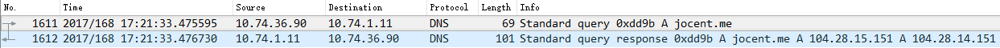

# DNS协议详解及报文格式分析
[TOC]

## 一. DNS协议理论知识
### 1.1 域名结构
域名系统并不像电话号码通讯录那么简单，通讯录主要是单个个体在使用，同一个名字出现在不同个体的通讯录里并不会出现问题，但域名是群体中所有人都在用的，必须要保持唯一性。为了达到唯一性的目的，因特网在命名的时候采用了层次结构的命名方法。每一个域名（本文只讨论英文域名）都是一个标号序列（labels），用字母（A-Z，a-z，大小写等价）、数字（0-9）和连接符（-）组成，标号序列总长度不能超过255个字符，它由点号分割成一个个的标号（label），每个标号应该在63个字符之内，每个标号都可以看成一个层次的域名。级别最低的域名写在左边，级别最高的域名写在右边。域名服务主要是基于UDP实现的，服务器的端口号为53。

比如：本网站的域名 jocent.me，由点号分割成了两个域名jocent 和 me，其中 me是顶级域名（TLD，Top-Level Domain）， jocent是二级域名（SLD，Second Level Domain）。关于域名的层次结构，请看下面的示意图。

> 注意：最开始的域名最后都是带了点号的，比如 jocent.me 搁以前的话应该是 jocent.me. ，最后面的点号表示根域名服务器，后来发现所有的网址都要加上最后的点，就简化了写法，干脆所有的都不加，但是你在网址后面加上点号也是可以正常解析的。

### 1.2 域名服务器

有域名结构还不行，还需要有一个东西去解析域名，手机通讯录是由通讯录软件解析的，域名需要由遍及全世界的域名服务器去解析，域名服务器实际上就是装有域名系统的主机。由高向低进行层次划分，可分为以下几大类：

- 根域名服务器：    最高层次的域名服务器，也是最重要的域名服务器，本地域名服务器如果解析不了域名就会向根域名服务器求助。全球共有13个不同IP地址的根域名服务器，它们的名称用一个英文字母命名，从a一直到m。这些服务器由各种组织控制，并由 ICANN（互联网名称和数字地址分配公司）授权，由于每分钟都要解析的名称数量多得令人难以置信，所以实际上每个根服务器都有镜像服务器，每个根服务器与它的镜像服务器共享同一个 IP 地址，中国大陆地区内只有6组根服务器镜像（F，I（3台），J，L）。当你对某个根服务器发出请求时，请求会被路由到该根服务器离你最近的镜像服务器。所有的根域名服务器都知道所有的顶级域名服务器的域名和地址，如果向根服务器发出对 “jocent.me” 的请求，则根服务器是不能在它的记录文件中找到与 “jocent.me” 匹配的记录。但是它会找到 “me” 的顶级域名记录，并把负责 “me” 地址的顶级域名服务器的地址发回给请求者。

- 顶级域名服务器：负责管理在该顶级域名服务器下注册的二级域名。当根域名服务器告诉查询者顶级域名服务器地址时，查询者紧接着就会到顶级域名服务器进行查询。比如还是查询"jocent.me"，根域名服务器已经告诉了查询者“me”顶级域名服务器的地址，“me”顶级域名服务器会找到 “jocent.me”的域名服务器的记录，域名服务器检查其区域文件，并发现它有与 “jocent.me” 相关联的区域文件。在此文件的内部，有该主机的记录。此记录说明此主机所在的 IP 地址，并向请求者返回最终答案。

- 权限域名服务器：负责一个区的域名解析工作

- 本地域名服务器：当一个主机发出DNS查询请求的时候，这个查询请求首先就是发给本地域名服务器的。

### 1.3 域名解析过程

域名解析总体可分为两大步骤，第一个步骤是本机向本地域名服务器发出一个DNS请求报文，报文里携带需要查询的域名；第二个步骤是本地域名服务器向本机回应一个DNS响应报文，里面包含域名对应的IP地址。从下面对jocent.me进行域名解析的报文中可明显看出这两大步骤。注意：第二大步骤中采用的是迭代查询，其实是包含了很多小步骤的，详情见下面的流程分析。

其具体的流程可描述如下：

1. 主机10.74.36.90先向本地域名服务器10.74.1.11进行递归查询
2. 本地域名服务器采用迭代查询，向一个根域名服务器进行查询
3. 根域名服务器告诉本地域名服务器，下一次应该查询的顶级域名服务器 dns.me的IP地址
4. 本地域名服务器向顶级域名服务器 dns.me进行查询
5. 顶级域名服务器me告诉本地域名服务器，下一步查询权限服务器dns.jocent.me 的IP地址
6. 本地域名服务器向权限服务器 dns.jocent.me进行查询
7. 权限服务器 dns.jocent.me告诉本地域名服务器所查询的主机的IP地址
8. 本地域名服务器最后把查询结果告诉 10.74.36.90

其中有两个概念递归查询和迭代查询，其实在整个描述的过程中已经体现的很明显，这里再说明一下：

- **递归查询**：本机向本地域名服务器发出一次查询请求，就静待最终的结果。如果本地域名服务器无法解析，自己会以DNS客户机的身份向其它域名服务器查询，直到得到最终的IP地址告诉本机
- **迭代查询**：本地域名服务器向根域名服务器查询，根域名服务器告诉它下一步到哪里去查询，然后它再去查，每次它都是以客户机的身份去各个服务器查询

## 二. DNS协议报文格式

### 2.1 头部

1. **会话标识（2字节）**：是DNS报文的ID标识，对于请求报文和其对应的应答报文，这个字段是相同的，通过它可以区分DNS应答报文是哪个请求的响应

2. **标志（2字节）**：

    | 字段名称       | 字段解释 |
    | :-----------: | :------------------------------ |
    | QR（1bit）     | 查询/响应标志，0为查询，1为响应 |
    | opcode（4bit） | 0表示标准查询，1表示反向查询，2表示服务器状态请求 |
    | AA（1bit）     | 表示授权回答 |
    | TC（1bit）     | 表示可截断的 |
    | RD（1bit）     | 表示期望递归 |
    | RA（1bit）     | 表示可用递归 |
    | rcode（4bit）  | 表示返回码，0表示没有差错，3表示名字差错，2表示服务器错误（Server Failure） |

3. 数量字段（总共8字节）：Questions、Answer RRs、Authority RRs、Additional RRs 各自表示后面的四个区域的数目。Questions表示查询问题区域节的数量，Answers表示回答区域的数量，Authoritative namesversers表示授权区域的数量，Additional recoreds表示附加区域的数量

### 2.2 正文

1. Queries区域
   - 1.1 **查询名**：长度不固定，且不使用填充字节，一般该字段表示的就是需要查询的域名（如果是反向查询，则为IP，反向查询即由IP地址反查域名），一般的格式如下图所示。

   - 1.2 **查询类型**：

      | 类型 | 助记符 | 说明 |
      | :--: | :---: | :--------------- |
      | 1    | A     | 由域名获得IPv4地址 |
      | 2   | NS     | 查询域名服务器 |
      | 5   | CNAME  | 查询规范名称 |
      | 6   | SOA    | 开始授权 |
      | 11  | WKS    | 熟知服务 |
      | 12  | PTR    | 把IP地址转换成域名 |
      | 13  | HINFO  | 主机信息 |
      | 15  | MX     | 邮件交换 |
      | 28  | AAAA   | 由域名获得IPv6地址 |
      | 252 | AXFR   | 传送整个区的请求 |
      | 255 | ANY    | 对所有记录的请求 |

     这里给一个域名，可用来模拟DNS的查询类型，可以选择不同的类型，比如A，PTR等玩一下， <https://www.nslookuptool.com/chs/>

   - 1.3 **查询类**：通常为1，表明是Internet数据
   
2. 资源记录(RR)区域（包括回答区域，授权区域和附加区域）
    该区域有三个，但格式都是一样的。这三个区域分别是：回答区域，授权区域和附加区域

   - 2.1 **域名（2字节或不定长）**：它的格式和Queries区域的查询名字字段是一样的。有一点不同就是，当报文中域名重复出现的时候，该字段使用2个字节的偏移指针来表示。比如，在资源记录中，域名通常是查询问题部分的域名的重复，因此用2字节的指针来表示，具体格式是最前面的两个高位是 11，用于识别指针。其余的14位从DNS报文的开始处计数（从0开始），指出该报文中的相应字节数。一个典型的例子，C00C(1100000000001100，12正好是头部的长度，其正好指向Queries区域的查询名字字段)。
   
   - 2.2 **查询类型**：表明资源纪录的类型，见1.2节的查询类型表格所示 
   
   - 2.3 **查询类**：对于Internet信息，总是IN
   
   - 2.4 **生存时间（TTL）**：以秒为单位，表示的是资源记录的生命周期，一般用于当地址解析程序取出资源记录后决定保存及使用缓存数据的时间，它同时也可以表明该资源记录的稳定程度，极为稳定的信息会被分配一个很大的值（比如86400，这是一天的秒数）。
   
   - 2.5 **资源数据**：该字段是一个可变长字段，表示按照查询段的要求返回的相关资源记录的数据。可以是Address（表明查询报文想要的回应是一个IP地址）或者CNAME（表明查询报文想要的回应是一个规范主机名）等。

## 三. Wireshark分析DNS协议

### 3.1 请求报文

### 3.2 响应报文

DNS相关的命令小贴士：

Windows环境下清空DNS缓存的命令是 ipconfig/flushdns 也可以通过重启DNS client 和 DHCP client 两项服务清空DNS缓存
Windows环境下可以用命令 ipconfig /displaydns  来查看DNS缓存的内容
nslookup 命令可以用来查看域名对应的IP地址，比如 nslookup jocent.me
本文撰写过程中参考了以下几篇博文的内容，现列出链接如下：

