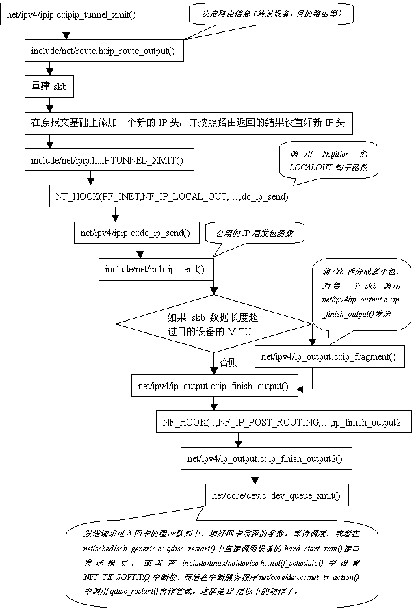
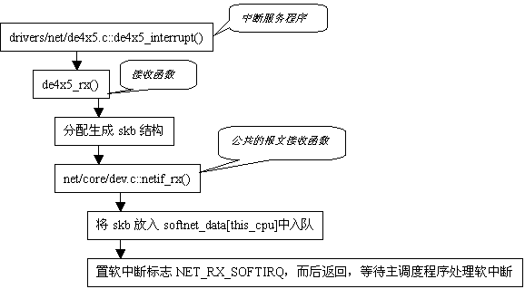
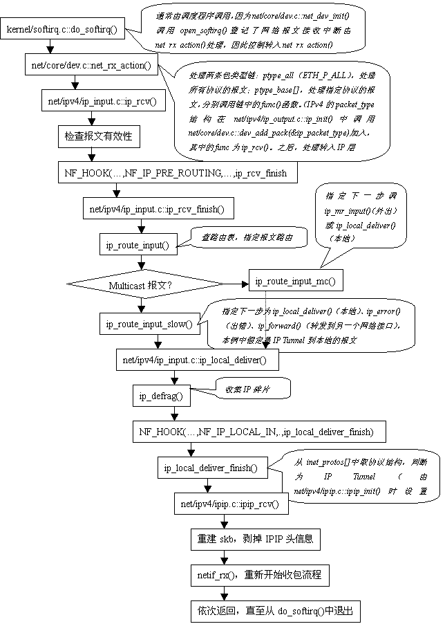
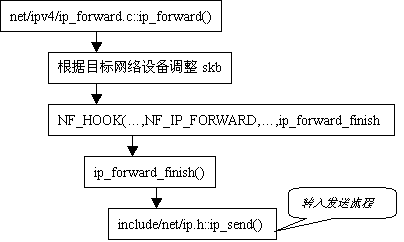
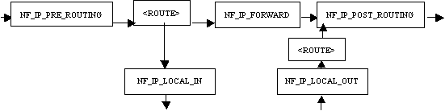
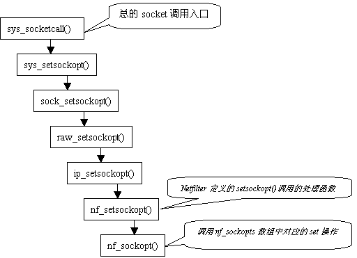
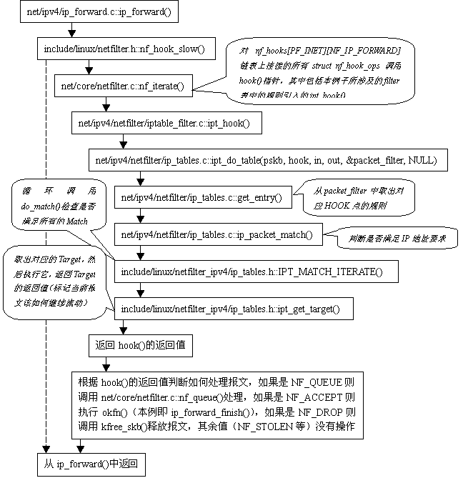
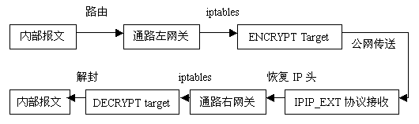

# Linux Netfilter实现机制和扩展技术
[TOC]

2.4.x的内核相对于2.2.x在IP协议栈部分有比较大的改动， Netfilter-iptables更是其一大特色，由于它功能强大，并且与内核完美结合，因此迅速成为Linux平台下进行网络应用扩展的主要利器，这些扩展不仅包括防火墙的实现--这只是Netfilter-iptables的基本功能--还包括各种报文处理工作（如报文加密、报文分类统计等），甚至还可以借助Netfilter-iptables机制来实现虚拟专用网（VPN）。本文将致力于深入剖析Netfilter-iptables的组织结构，并详细介绍如何对其进行扩展。Netfilter目前已在ARP、IPv4和IPv6中实现，考虑到IPv4是目前网络应用的主流，本文仅就IPv4的Netfilter实现进行分析。
要想理解Netfilter的工作原理，必须从对Linux IP报文处理流程的分析开始，Netfilter正是将自己紧密地构建在这一流程之中的。

## IP Packet Flowing

IP协议栈是Linux操作系统的主要组成部分，也是Linux的特色之一，素以高效稳定著称。Netfilter与IP协议栈是密切结合在一起的，要想理解Netfilter的工作方式，必须理解IP协议栈是如何对报文进行处理的。下面将通过一个经由IP Tunnel传输的TCP报文的流动路径，简要介绍一下IPv4协议栈（IP层）的结构和报文处理过程。
IP Tunnel是2.0.x内核就已经提供了的虚拟局域网技术，它在内核中建立一个虚拟的网络设备，将正常的报文（第二层）封装在IP报文中，再通过TCP/IP网络进行传送。如果在网关之间建立IP Tunnel，并配合ARP报文的解析，就可以实现虚拟局域网。
我们从报文进入IP Tunnel设备准备发送开始。

### 报文发送

ipip模块创建tunnel设备（设备名为tunl0~tunlx）时，设置报文发送接口（hard_start_xmit）为ipip_tunnel_xmit()，流程见下图：




## 报文接收

报文接收从网卡驱动程序开始，当网卡收到一个报文时，会产生一个中断，其驱动程序中的中断服务程序将调用确定的接收函数来处理。以下仍以IP Tunnel报文为例，网卡驱动程序为de4x5。流程分成两个阶段：驱动程序中断服务程序阶段和IP协议栈处理阶段，见下图：




如果报文需要转发，则在上图红箭头所指处调用ip_forward()：



## Netfilter Frame

Netfilter是2.4.x内核引入的，尽管它提供了对2.0.x内核中的ipfw以及2.2.x内核中的ipchains的兼容，但实际上它的工作和意义远不止于此。从上面对IP报文的流程分析中可以看出，Netfilter和IP报文的处理是完全结合在一起的，同时由于其结构相对独立，又是可以完全剥离的。这种机制也是Netfilter-iptables既高效又灵活的保证之一。
在剖析Netfilter机制之前，我们还是由浅入深的从Netfilter的使用开始。

### 编译

在Networking Options中选定Network packet filtering项，并将其下的IP：Netfilter Configurations小节的所有选项设为Module模式。编译并安装新内核，然后重启，系统的核内Netfilter就配置好了。以下对相关的内核配置选项稍作解释，也可以参阅编译系统自带的Help：

- 【Kernel/User netlink socket】建立一类PF_NETLINK套接字族，用于核心与用户进程通信。当Netfilter需要使用用户队列来管理某些报文时就要使用这一机制；
- 【Network packet filtering (replaces ipchains)】Netfilter主选项，提供Netfilter框架；
- 【Network packet filtering debugging】Netfilter主选项的分支，支持更详细的Netfilter报告；
- 【IP: Netfilter Configuration】此节下是netfilter的各种选项的集合：
- 【Connection tracking (required for masq/NAT)】连接跟踪，用于基于连接的报文处理，比如NAT；
- 【IP tables support (required for filtering/masq/NAT)】这是Netfilter的框架，NAT等应用的容器；
- 【ipchains (2.2-style) support】ipchains机制的兼容代码，在新的Netfilter结构上实现了ipchains接口；
- 【ipfwadm (2.0-style) support】2.0内核防火墙ipfwadm兼容代码，基于新的Netfilter实现。

### 总体结构

Netfilter是嵌入内核IP协议栈的一系列调用入口，设置在报文处理的路径上。网络报文按照来源和去向，可以分为三类：流入的、流经的和流出的，其中流入和流经的报文需要经过路由才能区分，而流经和流出的报文则需要经过投递，此外，流经的报文还有一个FORWARD的过程，即从一个NIC转到另一个NIC。Netfilter就是根据网络报文的流向，在以下几个点插入处理过程：
NF_IP_PRE_ROUTING，在报文作路由以前执行；
NF_IP_FORWARD，在报文转向另一个NIC以前执行；
NF_IP_POST_ROUTING，在报文流出以前执行；
NF_IP_LOCAL_IN，在流入本地的报文作路由以后执行；
NF_IP_LOCAL_OUT，在本地报文做流出路由前执行。
如图所示：



Netfilter框架为多种协议提供了一套类似的钩子（HOOK），用一个struct list_head nf_hooks[NPROTO][NF_MAX_HOOKS]二维数组结构存储，一维为协议族，二维为上面提到的各个调用入口。每个希望嵌入Netfilter中的模块都可以为多个协议族的多个调用点注册多个钩子函数（HOOK），这些钩子函数将形成一条函数指针链，每次协议栈代码执行到NF_HOOK()函数时（有多个时机），都会依次启动所有这些函数，处理参数所指定的协议栈内容。
每个注册的钩子函数经过处理后都将返回下列值之一，告知Netfilter核心代码处理结果，以便对报文采取相应的动作：

NF_ACCEPT：继续正常的报文处理；
NF_DROP：将报文丢弃；
NF_STOLEN：由钩子函数处理了该报文，不要再继续传送；
NF_QUEUE：将报文入队，通常交由用户程序处理；
NF_REPEAT：再次调用该钩子函数。

### IPTables

Netfilter-iptables由两部分组成，一部分是Netfilter的"钩子"，另一部分则是知道这些钩子函数如何工作的一套规则--这些规则存储在被称为iptables的数据结构之中。钩子函数通过访问iptables来判断应该返回什么值给Netfilter框架。

在现有（kernel 2.4.21）中已内建了三个iptables：filter、nat和mangle，绝大部分报文处理功能都可以通过在这些内建（built-in）的表格中填入规则完成：

filter，该模块的功能是过滤报文，不作任何修改，或者接受，或者拒绝。它在NF_IP_LOCAL_IN、NF_IP_FORWARD和NF_IP_LOCAL_OUT三处注册了钩子函数，也就是说，所有报文都将经过filter模块的处理。

nat，网络地址转换（Network Address Translation），该模块以Connection Tracking模块为基础，仅对每个连接的第一个报文进行匹配和处理，然后交由Connection Tracking模块将处理结果应用到该连接之后的所有报文。nat在NF_IP_PRE_ROUTING、NF_IP_POST_ROUTING注册了钩子函数，如果需要，还可以在NF_IP_LOCAL_IN和NF_IP_LOCAL_OUT两处注册钩子，提供对本地报文（出/入）的地址转换。nat仅对报文头的地址信息进行修改，而不修改报文内容，按所修改的部分，nat可分为源NAT（SNAT）和目的NAT（DNAT）两类，前者修改第一个报文的源地址部分，而后者则修改第一个报文的目的地址部分。SNAT可用来实现IP伪装，而DNAT则是透明代理的实现基础。

mangle，属于可以进行报文内容修改的IP Tables，可供修改的报文内容包括MARK、TOS、TTL等，mangle表的操作函数嵌入在Netfilter的NF_IP_PRE_ROUTING和NF_IP_LOCAL_OUT两处。

内核编程人员还可以通过注入模块，调用Netfilter的接口函数创建新的iptables。在下面的Netfilter-iptables应用中我们将进一步接触Netfilter的结构和使用方式。

### Netfilter配置工具

iptables是专门针对2.4.x内核的Netfilter制作的核外配置工具，通过socket接口对Netfilter进行操作，创建socket的方式如下：

socket(TC_AF, SOCK_RAW, IPPROTO_RAW)

其中TC_AF就是AF_INET。核外程序可以通过创建一个"原始IP套接字"获得访问Netfilter的句柄，然后通过getsockopt()和setsockopt()系统调用来读取、更改Netfilter设置，详情见下。

iptables功能强大，可以对核内的表进行操作，这些操作主要指对其中规则链的添加、修改、清除，它的命令行参数主要可分为四类：指定所操作的IP Tables（-t）；指定对该表所进行的操作（-A、-D等）；规则描述和匹配；对iptables命令本身的指令（-n等）。在下面的例子中，我们通过iptables将访问10.0.0.1的53端口（DNS）的TCP连接引导到192.168.0.1地址上。

iptables -t nat -A PREROUTING -p TCP -i eth0 -d 10.0.0.1 --dport 53 -j DNAT --to-destination 192.168.0.1

由于iptables是操作核内Netfilter的用户界面，有时也把Netfilter-iptables简称为iptables，以便与ipchains、ipfwadm等老版本的防火墙并列。

### iptables核心数据结构

#### 表

在Linux内核里，iptables用struct ipt_table表示，定义如下（include/linux/netfilter_ipv4/ip_tables.h）：

```c
struct ipt_table
{
    struct list_head list;
      /* 表链 */
    char name[IPT_TABLE_MAXNAMELEN];
      /* 表名，如"filter"、"nat"等，为了满足自动模块加载的设计，
     /* 包含该表的模块应命名为iptable_'name'.o */
    struct ipt_replace *table;
      /* 表模子，初始为initial_table.repl */
    unsigned int valid_hooks;
      /* 位向量，标示本表所影响的HOOK */
    rwlock_t lock;
      /* 读写锁，初始为打开状态 */
    struct ipt_table_info *private;
      /* iptable的数据区，见下 */
    struct module *me;
      /* 是否在模块中定义 */
};
struct ipt_table_info是实际描述表的数据结构（net/ipv4/netfilter/ip_tables.c）：
struct ipt_table_info
{
    unsigned int size;
      /* 表大小 */
    unsigned int number;
      /* 表中的规则数 */
    unsigned int initial_entries;
      /* 初始的规则数，用于模块计数 */
    unsigned int hook_entry[NF_IP_NUMHOOKS];
      /* 记录所影响的HOOK的规则入口相对于下面的entries变量的偏移量 */
    unsigned int underflow[NF_IP_NUMHOOKS];
      /* 与hook_entry相对应的规则表上限偏移量，当无规则录入时，
 /* 相应的hook_entry和underflow均为0 */
    char entries[0] ____cacheline_aligned;
      /* 规则表入口 */
};
```

例如内建的filter表初始定义如下（net/ipv4/netfilter/iptable_filter.c）：

```c
static struct ipt_table packet_filter
= { { NULL, NULL },    // 链表
"filter",        // 表名
   &initial_table.repl,    // 初始的表模板
    FILTER_VALID_HOOKS,// 定义为((1 << NF_IP6_LOCAL_IN) |
       (1 << NF_IP6_FORWARD) | (1 << NF_IP6_LOCAL_OUT))，
      即关心INPUT、FORWARD、OUTPUT三点
   RW_LOCK_UNLOCKED,// 锁
NULL,        // 初始的表数据为空
     THIS_MODULE     // 模块标示
};
```

经过调用ipt_register_table(&packet_filter)后，filter表的private数据区即参照模板填好了。

#### 规则

规则用struct ipt_entry结构表示，包含匹配用的IP头部分、一个Target和0个或多个Match。由于Match数不定，所以一条规则实际的占用空间是可变的。结构定义如下（include/linux/netfilter_ipv4）：

```c
struct ipt_entry
{
        struct ipt_ip ip;
            /* 所要匹配的报文的IP头信息 */
        unsigned int nfcache;
            /* 位向量，标示本规则关心报文的什么部分，暂未使用 */
        u_int16_t target_offset;
            /* target区的偏移，通常target区位于match区之后，而match区则在ipt_entry的末尾；
            初始化为sizeof(struct ipt_entry)，即假定没有match */
        u_int16_t next_offset;
            /* 下一条规则相对于本规则的偏移，也即本规则所用空间的总和，
            初始化为sizeof(struct ipt_entry)+sizeof(struct ipt_target)，即没有match */
    unsigned int comefrom;
            /* 位向量，标记调用本规则的HOOK号，可用于检查规则的有效性 */
    struct ipt_counters counters;
            /* 记录该规则处理过的报文数和报文总字节数 */
    unsigned char elems[0];
            /*target或者是match的起始位置 */
}
```

规则按照所关注的HOOK点，被放置在struct ipt_table::private->entries之后的区域，比邻排列。

#### 规则填写过程

在了解了iptables在核心中的数据结构之后，我们再通过遍历一次用户通过iptables配置程序填写规则的过程，来了解这些数据结构是如何工作的了。

一个最简单的规则可以描述为拒绝所有转发报文，用iptables命令表示就是：

```c
iptables -A FORWARD -j DROP;
```

iptables应用程序将命令行输入转换为程序可读的格式（iptables-standalone.c::main()::do_command()，然后再调用libiptc库提供的iptc_commit()函数向核心提交该操作请求。在libiptc/libiptc.c中定义了iptc_commit()（即TC_COMMIT()），它根据请求设置了一个struct ipt_replace结构，用来描述规则所涉及的表（filter）和HOOK点（FORWARD）等信息，并在其后附接当前这条规则--一个struct ipt_entry结构(实际上也可以是多个规则entry)。组织好这些数据后，iptc_commit()调用setsockopt()系统调用来启动核心处理这一请求：

```c
setsockopt(
sockfd,        
//通过socket(TC_AF, SOCK_RAW, IPPROTO_RAW)创建的套接字， 
//其中TC_AF即AF_INET
   TC_IPPROTO,    //即IPPROTO_IP
   SO_SET_REPLACE,   //即IPT_SO_SET_REPLACE
repl,          //struct ipt_replace结构
sizeof(*repl) + (*handle)->entries.size)    //ipt_replace加上后面的ipt_entry
```

核心对于setsockopt()的处理是从协议栈中一层层传递上来的，调用过程如下图所示：




nf_sockopts是在iptables进行初始化时通过nf_register_sockopt()函数生成的一个struct nf_sockopt_ops结构，对于ipv4来说，在net/ipv4/netfilter/ip_tables.c中定义了一个ipt_sockopts变量（struct nf_sockopt_ops），其中的set操作指定为do_ipt_set_ctl()，因此，当nf_sockopt()调用对应的set操作时，控制将转入net/ipv4/netfilter/ip_tables.c::do_ipt_set_ctl()中。

对于IPT_SO_SET_REPLACE命令，do_ipt_set_ctl()调用do_replace()来处理，该函数将用户层传入的struct ipt_replace和struct ipt_entry组织到filter（根据struct ipt_replace::name项）表的hook_entry[NF_IP_FORWARD]所指向的区域，如果是添加规则，结果将是filter表的private（struct ipt_table_info）项的hook_entry[NF_IP_FORWARD]和underflow[NF_IP_FORWARD]的差值扩大（用于容纳该规则），private->number加1。

#### 规则应用过程

以上描述了规则注入核内iptables的过程，这些规则都挂接在各自的表的相应HOOK入口处，当报文流经该HOOK时进行匹配，对于与规则匹配成功的报文，调用规则对应的Target来处理。仍以转发的报文为例，假定filter表中添加了如上所述的规则：拒绝所有转发报文。

如1.2节所示，经由本地转发的报文经过路由以后将调用ip_forward()来处理，在ip_forward()返回前，将调用如下代码：

```c
NF_HOOK(PF_INET, NF_IP_FORWARD, skb, skb->dev, dev2, ip_forward_finish)
NF_HOOK是这样一个宏（include/linux/netfilter.h）：
#define NF_HOOK(pf, hook, skb, indev, outdev, okfn)         \
(list_empty(&nf_hooks[(pf)][(hook)])                    \
 ? (okfn)(skb)                              \
 : nf_hook_slow((pf), (hook), (skb), (indev), (outdev), (okfn)))
```

也就是说，如果nf_hooks[PF_INET][NF_IP_FORWARD]所指向的链表为空（即该钩子上没有挂处理函数），则直接调用ip_forward_finish(skb)完成ip_forward()的操作；否则，则调用net/core/netfilter.c::nf_hook_slow()转入Netfilter的处理。

这里引入了一个nf_hooks链表二维数组：

```c
struct list_head nf_hooks[NPROTO][NF_MAX_HOOKS];
```

每一个希望使用Netfilter挂钩的表都需要将表处理函数在nf_hooks数组的相应链表上进行注册。对于filter表来说，在其初始化（net/ipv4/netfilter/iptable_filter.c::init()）时，调用了net/core/netfilter.c::nf_register_hook()，将预定义的三个struct nf_hook_ops结构（分别对应INPUT、FORWARD、OUTPUT链）连入链表中：

```c
struct nf_hook_ops
{
        struct list_head list;
            //链表
        nf_hookfn *hook;
            //处理函数指针
        int pf;
            //协议号
        int hooknum;
            //HOOK号
        int priority;
            //优先级，在nf_hooks链表中各处理函数按优先级排序
};
```

对于filter表来说，FORWARD点的hook设置成ipt_hook()，它将直接调用ipt_do_table()。几乎所有处理函数最终都将调用ipt_do_table()来查询表中的规则，以调用对应的target。下图所示即为在FORWARD点上调用nf_hook_slow()的过程：



#### Netfilter的结构特点

由上可见，nf_hooks链表数组是联系报文处理流程和iptables的纽带，在iptables初始化（各自的init()函数）时，一方面调用nf_register_table()建立规则容器，另一方面还要调用nf_register_hook()将自己的挂钩愿望表达给Netfilter框架。初始化完成之后，用户只需要通过用户级的iptables命令操作规则容器（添加规则、删除规则、修改规则等），而对规则的使用则完全不用操心。如果一个容器内没有规则，或者nf_hooks上没有需要表达的愿望，则报文处理照常进行，丝毫不受Netfilter-iptables的影响；即使报文经过了过滤规则的处理，它也会如同平时一样重新回到报文处理流程上来，因此从宏观上看，就像在行车过程中去了一趟加油站。

Netfilter不仅仅有此高效的设计，同时还具备很大的灵活性，这主要表现在Netfilter-iptables中的很多部分都是可扩充的，包括Table、Match、Target以及Connection Track Protocol Helper，下面一节将介绍这方面的内容。

## Netfilter-iptables Extensions

Netfilter提供的是一套HOOK框架，其优势是就是易于扩充。可供扩充的Netfilter构件主要包括Table、Match、Target和Connection Track Protocol Helper四类，分别对应四套扩展函数。所有扩展都包括核内、核外两个部分，核内部分置于<kernel-root>/net/ipv4/netfilter/下，模块名为ipt_'name'.o；核外部分置于<iptables-root>/extensions/下，动态链接库名为libipt_'name'.so。

### Table

Table在以上章节中已经做过介绍了，它作为规则存储的媒介，决定了该规则何时能起作用。系统提供的filter、nat、mangle涵盖了所有的HOOK点，因此，大部分应用都可以围绕这三个已存在的表进行，但也允许编程者定义自己的拥有特殊目的的表，这时需要参考已有表的struct ipt_table定义创建新的ipt_table数据结构，然后调用ipt_register_table()注册该新表，并调用ipt_register_hook()将新表与Netfilter HOOK相关联。

对表进行扩展的情形并不多见，因此这里也不详述。

### Match & Target

Match和Target是Netfilter-iptables中最常使用的功能，灵活使用Match和Target，可以完成绝大多数报文处理功能。

#### Match数据结构

核心用struct ipt_match表征一个Match数据结构：

```c
struct ipt_match
{
  struct list_head list;
    /* 通常初始化成{NULL,NULL}，由核心使用 */
  const char name[IPT_FUNCTION_MAXNAMELEN];
    /* Match的名字，同时也要求包含该Match的模块文件名为ipt_'name'.o */
  int (*match)(const struct sk_buff *skb,
         const struct net_device *in,
         const struct net_device *out,
         const void *matchinfo,
         int offset,
         const void *hdr,
         u_int16_t datalen,
         int *hotdrop);
    /* 返回非0表示匹配成功，如果返回0且hotdrop设为1，
    则表示该报文应当立刻丢弃 */
  int (*checkentry)(const char *tablename,
        const struct ipt_ip *ip,
        void *matchinfo,
        unsigned int matchinfosize,
        unsigned int hook_mask);
    /* 在使用本Match的规则注入表中之前调用，进行有效性检查，
       如果返回0，规则就不会加入iptables中 */
  void (*destroy)(void *matchinfo, unsigned int matchinfosize);
    /* 在包含本Match的规则从表中删除时调用，ß与checkentry配合可用于动态内存分配和释放 */
  struct module *me; /* 表示当前Match是否为模块（NULL为否） */
};
```

定义好一个ipt_match结构后，可调用ipt_register_match()将本Match注册到ipt_match链表中备用，在模块方式下，该函数通常在init_module()中执行。

#### Match的用户级设置

要使用核心定义的Match（包括已有的和自定义的），必须在用户级的iptables程序中有所说明，iptables源代码也提供了已知的核心Match，但未知的Match则需要自行添加说明。

在iptables中，一个Match用struct iptables_match表示：

```c
struct iptables_match
{
  struct iptables_match *next;
    /* Match链，初始为NULL */
  ipt_chainlabel name;
    /* Match名，和核心模块加载类似，作为动态链接库存在的
    Iptables Extension的命名规则为libipt_'name'.so（对于ipv6为libip6t_'name'.so），
    以便于iptables主程序根据Match名加载相应的动态链接库 */
  const char *version;
    /* 版本信息，一般设为NETFILTER_VERSION */
  size_t size;
    /* Match数据的大小，必须用IPT_ALIGN()宏指定对界 */
  size_t userspacesize;
    /*由于内核可能修改某些域，因此size可能与确切的用户数据不同，
    这时就应该把不会被改变的数据放在数据区的前面部分，
    而这里就应该填写被改变的数据区大小；一般来说，这个值和size相同 */
  void (*help)(void);
    /* 当iptables要求显示当前match的信息时（比如iptables -m ip_ext -h），
    就会调用这个函数，输出在iptables程序的通用信息之后 */
  void (*init)(struct ipt_entry_match *m, unsigned int *nfcache);
    /* 初始化，在parse之前调用 */
  int (*parse)(int c, char **argv, int invert, unsigned int *flags,
         const struct ipt_entry *entry,
         unsigned int *nfcache,
         struct ipt_entry_match **match);
    /* 扫描并接收本match的命令行参数，正确接收时返回非0，flags用于保存状态信息 */
  void (*final_check)(unsigned int flags);
    /* 当命令行参数全部处理完毕以后调用，如果不正确，应该退出（exit_error()） */
  void (*print)(const struct ipt_ip *ip,
          const struct ipt_entry_match *match, int numeric);
    /* 当查询当前表中的规则时，显示使用了当前match的规则的额外的信息 */
  void (*save)(const struct ipt_ip *ip,
         const struct ipt_entry_match *match);
    /* 按照parse允许的格式将本match的命令行参数输出到标准输出，
    用于iptables-save命令 */
  const struct option *extra_opts;
    /*  NULL结尾的参数列表，struct option与getopt(3)使用的结构相同 */
  /* 以下参数由iptables内部使用，用户不用关心 */
  unsigned int option_offset;
  struct ipt_entry_match *m;
  unsigned int mflags;
  unsigned int used;
}
struct option {
    const char *name; /* 参数名称，用于匹配命令行输入 */
    int has_arg; /* 本参数项是否允许带参数，0表示没有，1表示有，2表示可有可无 */
    int *flag; /* 指定返回的参数值内容，如果为NULL，则直接返回下面的val值，否则返回0，val存于flag所指向的位置 */
    int val; /* 缺省的参数值 */
}
```

如对于--opt <value>参数来讲，在struct option中定义为{"opt",1,0,'1'}，表示opt带参数值，如果出现-opt <value>参数，则返回'1'用于parse()中的int c参数。
实际使用时，各个函数都可以为空，只要保证name项与核心的对应Match名字相同就可以了。在定义了iptables_match之后，可以调用register_match()让iptables主体识别这个新Match。当iptables命令中第一次指定使用名为ip_ext的Match时，iptables主程序会自动加载libipt_ip_ext.so，并执行其中的_init()接口，所以register_match()操作应该放在_init()中执行。

#### Target数据结构

Target数据结构struct ipt_target和struct ipt_match基本相同，不同之处只是用target函数指针代替match函数指针：

```c
struct ipt_target
{
    ……
unsigned int (*target)(struct sk_buff **pskb,
               unsigned int hooknum,
               const struct net_device *in,
               const struct net_device *out,
               const void *targinfo,
               void *userdata);
    /* 如果需要继续处理则返回IPT_CONTINUE（-1），
    否则返回NF_ACCEPT、NF_DROP等值，
    它的调用者根据它的返回值来判断如何处理它处理过的报文*/
……
}
```

与ipt_register_match()对应，Target使用ipt_register_target()来进行注册，但文件命名、使用方法等均与Match相同。

#### Target的用户级设置

Target的用户级设置使用struct iptables_target结构，与struct iptables_match完全相同。register_target()用于注册新Target，方法也与Match相同。

### Connection Track Protocol Helper

前面提到，NAT仅对一个连接（TCP或UDP）的第一个报文进行处理，之后就依靠Connection Track机制来完成对后续报文的处理。Connection Track是一套可以和NAT配合使用的机制，用于在传输层（甚至应用层）处理与更高层协议相关的动作。
关于Connection Track，Netfilter中的实现比较复杂，而且实际应用频率不高，因此这里就不展开了，以后专文介绍。

### iptables patch机制

对于Netfilter-iptables扩展工作，用户当然可以直接修改源代码并编译安装，但为了标准化和简便起见，在iptables源码包提供了一套patch机制，希望用户按照其格式要求进行扩展，而不必分别修改内核和iptables代码。

和Netfilter-iptables的结构特点相适应，对iptables进行扩展也需要同时修改内核和iptables程序代码，因此patch也分为两个部分。在iptables-1.2.8中，核内补丁由patch-o-matic包提供，iptables-1.2.8的源码中的extensions目录则为iptables程序本身的补丁。

patch-o-matic提供了一个'runme'脚本来给核心打patch，按照它的规范，核内补丁应该包括五个部分，且命名有一定的规范，例如，如果Target名为ip_ext，那么这五个部分的文件名和功能分别为：

- ip_ext.patch  主文件，内容为diff格式的核心.c、.h源文件补丁，实际使用时类似给内核打patch（patch -p0 <ip_ext.patch）；
- ip_ext.patch.config.in 对<kernel-root>/net/ipv4/netfilter/Config.in文件的修改，第一行是原Config.in中的一行，以指示补丁添加的位置，后面则是添加在以上匹配行之后的内容。这个补丁的作用是使核心的配置界面中支持新增加的补丁选项；
- ip_ext.patch.configure.help 对<kernel-root>/Documentation/Configure.help的修改，第一行为原Configure.help中的一行帮助索引，以下几行的内容添加在这一行相关的帮助之后。这个补丁的作用是补充内核配置时对新增加的选项的说明；
- ip_ext.patch.help 用于runme脚本显示本patch的帮助信息；
- ip_ext.patch.makefile 对<kernel-root>/net/ipv4/netfilter/Makefile的修改，和前两个文件的格式相同，用于在指定的位置上添加用于生成ipt_ip_ext.o的make指令。

示例可以参看patch-o-matic下的源文件。

iptables本身的扩展稍微简单一些，那就是在extensions目录下增加一个libipt_ip_ext.c的文件，然后在本子目录的Makefile的PF_EXT_SLIB宏中附加一个ip_ext字符串。

第一次安装时，可以在iptables的根目录下运行make pending-patches命令，此命令会自动调用runme脚本，将所有patch-o-matic下的patch文件打到内核中，之后需要重新配置和编译内核。

如果只需要安装所要求的patch，可以在patch-o-matic目录下直接运行runme ip_ext，它会完成ip_ext patch的安装。之后，仍然要重编内核以使patch生效。

iptables本身的make/make install过程可以编译并安装好libipt_ip_ext.so，之后，新的iptables命令就可以通过加载libipt_ip_ext.so来识别ip_ext target了。

Extensions还可以定义头文件，一般这个头文件核内核外都要用，因此，通常将其放置在<kernel-root>/include/linux/netfilter_ipv4/目录下，在.c文件里指定头文件目录为linux/netfilter_ipv4/。

灵活性是Netfilter-iptables机制的一大特色，因此，扩展Netfilter-iptables也是它的应用的关键。为了与此目标相适应，Netfilter-iptables在结构上便于扩展，同时也提供了一套扩展的方案，并有大量扩展样例可供参考。

## 案例：用Netfilter实现VPN

虚拟专用网的关键就是隧道（Tunnel）技术，即将报文封装起来通过公用网络。利用Netfilter-iptables对报文的强大处理能力，完全可以以最小的开发成本实现一个高可配置的VPN。

本文第一部分即描述了IP Tunnel技术中报文的流动过程，从中可见，IP Tunnel技术的特殊之处有两点：

- 一个特殊的网络设备tunl0~tunlx--发送时，用指定路由的办法将需要封装的内网报文交给该网络设备来处理，在"网卡驱动程序"中作封装，然后再作为正常的IP报文交给真正的网络设备发送出去；
- 个特殊的IP层协议IPIP--从外网传来的封装报文拥有一个特殊的协议号（IPIP），报文最终在该协议的处理程序（ipip_rcv()）中解封，恢复内网IP头后，将报文注入IP协议栈底层（netif_rx()）重新开始收包流程。

从中不难看出，在报文流出tunlx设备之后（即完成封装之后）需要经过OUTPUT的Netfilter HOOK点，而在报文解封之前（ipip_rcv()得到报文之前），也要经过Netfilter的INPUT HOOK点，因此，完全有可能在这两个HOOK上做文章，完成报文的封装和解封过程。报文的接收过程可以直接沿用IPIP的处理方法，即自定义一个专门的协议，问题的关键即在于如何获得需要封装的外发报文，从而与正常的非VPN报文相区别。我们的做法是利用Netfilter-iptables对IP头信息的敏感程度，在内网中使用标准的内网专用IP段（如192.168.xxx.xxx），从而通过IP地址将其区分开。基于IP地址的VPN配置既方便现有系统管理、又便于今后VPN系统升级后的扩充，而且可以结合Netfilter-iptables的防火墙设置，将VPN和防火墙有机地结合起来，共同维护一个安全的专用网络。

在我们的方案中，VPN采用LAN-LAN方式（当然，Dial-in方式在技术上并没有什么区别），在LAN网关处设置我们的VPN管理组件，从而构成一个安全网关。LAN内部的节点既可以正常访问防火墙限制以外非敏感的外网（如Internet的大部分站点），又可以通过安全网关的甄别，利用VPN访问其他的专用网LAN。

由于本应用与原有的三个表在功能和所关心的HOOK点上有所不同，因此我们仿照filter表新建了一个vpn表，VPN功能分布在以下四个部分中：

- iptables ENCRYPT Target：对于发往安全子网的报文，要求经过ENCRYPT target处理，加密原报文，产生认证码，并将报文封装在公网IPIP_EXT报文头中。ENCRYPT Target配置在vpn表的OUTPUT和FORWARD HOOK点上，根据目的方IP地址来区分是否需要经过ENCRYPT target加密处理。
- IPIP_EXT协议：在接收该协议报文的处理函数IPIP_EXT_rcv()中用安全子网的IP地址信息代替公网间传输的隧道报文头中的IP地址，然后重新注入IP协议栈底层。
- iptables IPIP_EXT Match：匹配报文头的协议标识是否为自定义的IPIP_EXT。经过IPIP_EXT_rcv()处理之后的报文必须是IPIP_EXT协议类型的，否则应丢弃。
- iptables DECRYPT Target：对于接收到的来自安全子网的报文，经过IPIP_EXT协议处理之后，将IP头恢复为安全子网之间通信的IP头，再进入DECRYPT target处理，对报文进行完全解密和解封。

整个报文传输的流程可以用下图表示：


对于外出报文（源于本地或内网），使用内部地址在FORWARD/OUTPUT点匹配成功，执行ENCRYPT，从Netfilter中返回后作为本地IPIP_EXT协议的报文继续往外发送。

对于接收到的报文，如果协议号为IPPROTO_IPIP_EXT，则匹配IPIP_EXT的Match成功，否则将在INPUT点被丢弃；继续传送的报文从IP层传给IPIP_EXT的协议处理代码接收，在其中恢复内网IP的报文头后调用netif_rx()重新流入协议栈。此时的报文将在INPUT/FORWARD点匹配规则，并执行DECRYPT，只有通过了DECRYPT的报文才能继续传送到本机的上层协议或者内网。

附：iptables设置指令（样例）：

```bash
iptables -t vpn -P FORWARD DROP
iptables -t vpn -A OUTPUT -d 192.168.0.0/24 -j ENCRYPT
iptables -t vpn -A INPUT -s 192.168.0.0/24 -m ipip_ah -j DECRYPT
iptables -t vpn -A FORWARD -s 192.168.0.0/24 -d 192.168.1.0 -j DECRYPT
iptables -t vpn -A FORWARD -s 192.168.1.0/24 -d 192.168.0.0/24 -j ENCRYPT
```

其中192.168.0.0/24是目的子网，192.168.1.0/24是本地子网


