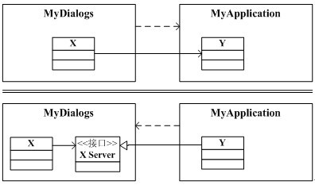

# 包的设计原则

[TOC]

随着应用程序的规模和复杂度的增加，需要在更高的层次对它们进行组织。类对于小型应用程序来说事非常方便的组织单元，但是对于大型应用程序来 说，如果仅仅使用类作为唯一的组织单元，就会显得粒度过细。因此，就需要比类“大”的“东西”来辅助大型应用程序的组织。这个“东西”就是包 （package）。

本节描述了6个原则。前3个原则关注包的内聚性，这些原则能够指导我们如何把类划分到包中。后3个原则关注包的耦合性，这些原则帮助我们确定包之间的相互关系。

在UML的概念中，包可以用作包容一组类的容器。通过把类组织成包，我们可以在更高层次的抽象上来理解设计。我们也可以通过包来管理软件的开发和发布。目的就是根据一些原则对应用程序中的类进行划分，然后把这些划分后的类分配到包中。

但是类经常会和其他类之间存在着依赖关系，这些依赖关系还经常会跨越包的边界。因此，包之间也会产生依赖关系。包之间的依赖关系展现了应用程序的高层组织结构。我们应该对这些关系进行管理。

## 一 粒度：包的内聚性原则

这里要讲述的3个关于包的内聚性原则，可以帮助开发者决定如何把类划分到包中。这些原则依赖与这样的事实：至少已经存在一些类，并且它们之间的相互关系也已经确定。因此，这些原则是根据“自底向上”的观点对类进行划分的。

### 1.1 重用发布等价原则（**REP**）

**重用的粒度就是发布的粒度：一个包中的软件要么都是可重用的，要么都是不可重用的。**

当你重用一个类库时，对这个类库的作者有什么期望呢？你当然想得到好的文档，可以工作的代码，规格清晰的接口等。但是，你还会有其他的期望。

- 首先，你希望代码的作者能保证为你维护这些代码，只有这样才值得你在重用这些代码上花费时间。毕竟，如果需要你亲自去维护这些代码，那将会花费你大量的时间，这些时间也许可以自己用来设计一个小些但是好些的包。

- 其次，你希望代码的作者在计划对代码的接口和功能进行任何改变时，提前通知你一下。但是仅仅通知一下是不够的。代码的作者必须尊重你拒绝使用任何新版本 的权力。否则，当你处在开发进度中的一个关键时刻时，他可能发布了一个新的版本。或者他对代码进行了改变，之后就干脆再也无法与你的系统兼容了。

无论在哪种情况下，如果你决定不接纳新版本，作者必须保证对于你所使用的旧版本继续提供一段时间的支持。这段时间也许只有3个月，或者长达1年，你们两 个人之间必须就这些事情进行磋商。但是，他不能和你断绝关系并且拒绝对你提供支持。如果他不同意对你使用的稍旧一点的版本提供支持，那么你就应该认真的考 虑一下是否情愿忍受对方反复无常的变化，而继续使用他的代码。

这个问题主要是行政问题。如果有其他的人将要重用代码，就必须要进行行政和支持方面的工作。但是这些行政上的问题对于软件包的结构具有深刻的影响。为了给重用者提供所需的保证，代码的作者必须把它们的软件组织到一个可重用的包中，并且通过版本号对这些包进行跟踪。

REP指出，一个包的重用粒度（granule of reuse）可以和发布粒度（granule of release）一样大。我们说重用的任何东西都必须同时被发布和跟踪。简单的编写一个类，然后声称它是可重用的做法是不现实的。只有在建立一个跟踪系 统，为潜在的使用者提供所需的变更通知、安全性以及支持后，重用才有可能。

REP带给了我们关于如何把设计划分到包中的第一个提示。由于重用性必须是基于包的，所以可重用的包必须包含可重用的类。因此，至少，某些包应该有一组可重用的类组成。

行政上的约束力将会影响到对软件的划分，这看上去会令人不安，但是软件不是一个可以依据纯数学规则组织起来的纯数学实体。软件是一个人的智力活动的产品。软件由人创建并被人使用，并且如果我们将要对软件进行重用，那么它肯定以一种人认为方便重用的方式进行划分。

那么，关于包的内部结构方面，我们学到了什么呢？我们必须从潜在的重用者的角度去考虑包的内容。如果一个包中的软件是用来重用的，那么它就不能再包含不是为了重用的目的而设计的代码。一个包中的代码要么都是可重用的，要么都是不可重用的。

可重用性不是唯一的标准，我们也要考虑重用这些软件的人。当然，一个容器类库是可重用的，一个金融方面的框架也是可重用的。但是，我们不希望把它们放进 同一个包中。很多希望重用容器类库的人可能对于金融框架根本不感兴趣。因此，我们希望一个包中的所有类对于同一类用户来说都是可重用的。我们不希望一个用 户发现包中所包含的类中，一些是他所需要的，另一些对他却完全没用。

### 1.2 共同重用原则（**CRP**）

**一个包中所有类应该是共同重用的。如果重用了包中的一个类，那么就重用包中的所有类。**

这个原则可以帮助我们决定哪些类应该放在同一个包中。它规定了趋向共同重用的类应该属于同一个包。

类很少会孤立地重用。一般来说，可重用的类需要与作为该可重用抽象一部分的其他类协作。CRP规定了这些类应该属于同一个包。在这样的一个包中，我们会看到类之间有很多的互相依赖。

一个简单的例子是容器类以及与它关联的迭代器类。这些类彼此之间紧密耦合在一起，因此必须共同重用。所以它们应该在同一个包中

但是，CRP告诉我们的不仅仅是什么类应该共同放入一个包中。它还告诉我们什么类不应该放入同一个包中。当一个包使用了另一个包时，它们之间会存在一个 依赖关系。也许一个包仅仅使用了另外一个包中的一个类。然而，那根本不会削弱这两个包之间的依赖关系。使用者包依然依赖于被使用的包。每当被使用的包发布 时，使用者包必须进行重新验证和重新发布。即使发布的原因仅仅改变了一个使用者包根本不关心的类，也必须要这样做。

此外，包也经常以共享库、DLL、JAR等物理表示的形式出现。如果被使用的包以JAR的形式发布，那么使用这个包的代码就依赖于整个JAR。对JAR的任 何修改——即使所修改的是与用户代码无关的类，也会造成这个JAR的一个新版本发布。这个新JAR也要重新发行，并且，使用这个JAR的代码也要进行重新 验证。

因此，我想确信当我依赖于一个包时，我将依赖于那个包中的每一个类。换句话说，我想确信我放入一个包中的所有类是不可分开的，仅仅依赖于其中一部分的情况是不可能的。否则，我将要进行不必要的重新验证和重新发行，并且会白费相当数量的努力。

因此，CRP告诉我们更多的是，什么类不应该放在一起。CRP规定相互之间没有紧密联系的类不应该放在同一个包中。

### 1.3 共同封闭原则（**CCP**）

**包中的所有类对于同一类性质的变化应该是共同封闭的。一个变化若对一个包产生影响，则将对包中的所有类产生影响，而对于其他的包不造成任何影响。**

这是单一职责原则（**SRP**）对于包的重新规定。正如**SRP**规定的一个类不应该包含多个引起变化的原因那样，这个原则规定了一个包不应该包含多个引起变化的原因。

在大多数的应用中，可维护性的重要性是超过可重用性的。如果一个应用中的代码必须更改，那么我们宁愿更改都集中在一个包中，而不是分布在多个包中。如果 更改集中在一个单一的包中，那么我们仅仅需要发布那一个更改了的包。不依赖于那个更改了的包的其他包则不需要重新验证或重新发布。

**CCP**鼓励我们把可能由于同样的原因而改变的所有类共同聚集在同一个地方。如果两个类之间有非常紧密的绑定关系，不管是物理上的还是概念上的，那么它们总会一同进行变化，因而它们应该属于同一个包中，这样做会减少软件的发布、重新验证、重新发行的工作量。

这个原则和开放－封闭原则（**OCP**）密切相关。本原则中“封闭”这个词和**OCP**中的具有同样的含义。**OCP**规定了类对于修改应该是封闭的，对于扩展应该是开放的。但是，正如我们所学到的，100％的封闭是不可能的。应当进行有策略的封闭。我们所设计的系统应该对于我们经历过的最常见的变化做到封闭。

**CCP**通过把对于一些确定的变化类型开放的类共同组织到同一个包中，从而增强了上述内容。因而，当需求中的一个变化到来时，那个变化就会很有可能被限制在最小数量的包中。

### 1.4 包内聚性总结

过去，我们对内聚性的认识要远比上面3个原则所蕴含的简单。我们习惯于认为内聚性只不过是指一个模块执行一项并且仅仅一项功能。然而，这3个关于包内聚性的 原则描述了有关内聚性的更丰富的变化。在选择要共同组织到包中的类时，必须要考虑可重用性与可开发性（develop ability）之间的相反作用力。在这些作用力和应用的需要之间进行平衡不是一件简单的工作。此外，这个平衡几乎总是动态的。也就是说，今天看起来合适 的划分到了明年也许就不再合适了。因此，当项目的重心从可开发性向可重用性转变时，包的组成很可能会变动并随时间而演化。

## 二 稳定性：包的耦合性原则

接下来的3个原则用来处理包之间的关系。这里，我们会再次碰到可开发性与逻辑设计之间的冲突力（tension）。来自技术和行政方面的作用力都会影响到包的组织结构，并且这种作用力还是易变的。

### 2.1 无环依赖原则（**ADP**）

**在包的依赖图中，不允许存在环。**

考虑图中的包图。图中展示了组成一个应用程序的非常典型的包结构。相对于本例的意图来说，该应用程序的功能并不重要。重要的是包的依 赖关系结构。请注意，该机构是一个有向图（directed graph）。其中，包是结点（node），依赖关系是有向边（directed edge）。

现在，请注意另外一件事情。无论从哪个包开始，都无法沿着依赖关系而回绕到这个包。该结构中没有环。它是一个有向无环图（DAG）。

当负责MyDialogs的团队发布了该包的一个新版本时，会很容易找出受影响的包：只需逆着依赖关系指向寻找即可。因此，MyTasks和MyApplication都会受到影响。当前工作于这两个包的开发人员就要决定何时应该和MyDialogs的新版本集成。

还要注意，当MyDialogs发布时，完全不会影响到系统中许多其他包。它们不知道MyDialogs，并且也不关心何时对MyDialogs进行了更改。这很好。这意味着发布MyDialogs的影响相对较小。

当工作于MyDialogs包的开发人员想要运行该包的测试时，只需把他们的MyDialogs版本和当前正使用的Windows包的版本一起编译、链 接即可。不会涉及到系统中任何其他包。这很好。这意味着工作于MyDialogs的开发人员只需较少的工作即可建立一个测试，而且他们要考虑的变数 （variable）也不多。

在发布整个系统时，是自底向上进行的。首先编译、测试已经发布Windows包。接着是 MessageWindow和MyDiaolgs。在它们之后是Tasks，然后是TaskWindow和Database。接着是MyTasks，最后 是MyApplication。这个过程非常清楚并且易于处理。我们知道如何去构建系统，因为我们理解系统各个部分的依赖关系。

#### 2.1.1 包依赖关系图中环造成的影响

如果一个新需求迫使我们更改MyDialogs中的一个类去使用MyApplication中的一个类。这就产生了一个依赖关系环，如图所示：

这个依赖环会导致一些直接后果。例如，工作于MyTasks包的开发人员知道，为了发布MyTasks包，它们必须得兼容Task、 MyDialogs、Database以及Windows。然而，由于依赖关系的存在，它们现在必须也兼容MyApplication、 TaskWindow、以及MessageWindow。也就是说，现在MyTasks依赖于系统中所有其他的包。这就致使MyTasks非常难以发布。 MyDialogs有着同样的问题。事实上，该依赖关系会迫使MyApplication、MyTasks以及MyDialogs总是同时发布。它们实际 上已经变成了同一个大包。于是，在这些包上工作的所有开发人员，他们彼此之间的发布行动要完全一致，因为它们必须都要使用彼此间完全相同的版本。

这还只是部分问题。考虑一下在想要测试MyDialogs包时会发生什么。我们必须要链接进系统中所有其他的包，包括Database包。这意味着仅仅为了测试MyDialogs就必须做一次完整的构建。这是不可忍受的。

如果想知道为何必须要链接进这么多不同的库，以及这么多其他人的代码，只需运行一个某个类的简单单元测试即可，或许这是因为依赖关系图中存在环的缘故。 这种环使得非常难以对模块进行隔离。单元测试和发布变得非常困难且易于出错。而且，在C++中，编译时间会随模块的数目成几何级数增长。

此外，如果依赖关系图中存在环，就很难确定包构建的顺序。事实上，也许就不存在恰当的顺序。对于像Java一样要从编译过的二进制文件中读取它们的声明的语言来说，这会导致一些非常讨厌的问题。

#### 2.1.2 解除依赖环

任何情况下，都可以解除包之间的依赖环并把依赖关系图恢复为一个DAG。有两个主要的方法：

1. 使用依赖倒置原则（DIP）。针这样的情况，可以创建一个具有MyDialogs需要的接口的抽象基类。然后，把该抽 象基类放进MyDialogs中，并使MyApplication中的类从其继承。这就倒置了MyDialogs和MyApplication间的依赖关 系，从而解除了依赖关系环。
    

2. 新创建一个MyDialogs和MyApplication都依赖的包。把MyDialogs和MyApplication都依赖的类移到这个新包中。
   

第2个解决方案意味着，在需求改变面前，包的结构是不稳定的。事实上，随着应用程序的增长，包的依赖关系结构会抖动（jitter）和增长。因此，必须 始终要对依赖关系结构中环的情况进行监控。如果出现了环，就必须要使用某种方法把其解除。有时这意味着要创建新的包，致使依赖关系结构增长。

#### 2.1.3 自顶向下设计

讨论到现在，我们可以得出一个必然的结论：不能自顶向下设计包的结构。这意味着，包结构不是设计系统时首先考虑的事情之一。事实上，包结构应该时随着系统的增长、变化而逐步演化的。

也许你会认为这是违反直觉的。我们已经认为像包这样的大粒度分解同样也是高层的功能分解。当我们看到一个像包依赖关系结构这样的大粒度分组时，就会觉得包应该以某种方式描绘了系统的功能。然而，这可能不是包依赖关系图的一个属性。

事实上，包的依赖关系图和描绘应用程序的功能之间几乎没有关系。相反，它们是应用程序可构建性的映射图。这 就是为何不在项目开始时设计它们的原因。在项目开始时，没有软件可构建，因此也无需构建映射图。但是，随着实现和设计初期累积的类越来越多，对依赖关系进 行管理的需要就不断增长。此外，我们也想尽可能地保持更改的局部化，所以我们开始关注SRP和CCP，并把可能会一同变化的类放在一起。

随着应用程序的不断增长，我们开始关注创建可重用的元素。于是，就开始使用CRP来指导包的组合。最后，当环出现时，就会使用ADP，从而，包的依赖关系图会出现抖动以及增长。

如果在设计任何类之前试图去设计包的依赖关系结构，那么很可能会遭受惨败。我们对于共同封闭还没有多少了解，也还没有觉察到任何可重用的元素，从而，几乎当然会创建产生依赖环的包。所以，　　　　
　　
### 2.2 稳定依赖原则（**SDP**）

**朝着稳定的方向进行依赖。**

设计不能是完全固定的。要使设计可维护，某种程度的易变性是必要的。我们通过遵循共同封闭原则（CCP）来达到这个目标。使用这个原则，可以创建对某些变化类型敏感的包。这些包被设计成可变的。我们期望它们的变化。

对于任何包而言，如果期望它是可变的，就不应该让一个难以改变的包依赖于它！否则，可变的包同样也会难以更改。

你设计了一个易于更改的包，其他人只要创建一个对它的依赖就可以使它变得难以更改，这就是软件的反常特性。没有改变你的模块中任何一行代码，可是它突然之间就变得难以更改了。通过遵循SDP，我们可以确保那些打算易于更改的模块不会被那些比它们难以更改的模块所依赖。

#### 2.2.1 并非所有的包都应该是稳定的

如果一个系统在所有的包都是最大程度稳定的，那么该系统就是不能改变的。这不是所希望的情形。事实上，我们希望所设计出来的包结构中，一些包是不稳定的而另外一些是稳定的。图2.6.2.2.1-1中展示了一个具有3个包的系统的理想配置。

可改变的包位于顶部并依赖于底部稳定的包。把不稳定的包放在图的顶部是一个有用的约定，因为任何一个向上的箭头都意味着违反了SDP。
　 　
下图展示了会违反SDP的做法。我们打算让Flexible包易于更改。我们希望Flexible是不稳定的。然而，一些工作于包 Stable的开发人员，创建了一个对Flexible的依赖。这违反了SDP。结果，Flexible就不再易于更改了。对Flexible的更改会迫 使我们去处理该更改对Stable及其所有依赖者的影响。

要修正这个问题，我们就必须要以某种方式解除Stable对Flexible的依赖。为什么会存在这个依赖关系呢？我们假设Flexible中有一个类C被另一个Stable中的类U使用

可以使用DIP来修正这个问题。我们创建一个接口类IU并把它放到包UInterface中。我们确保IU中声明了U要使用的所有方法。接着，我们让C 从这个接口继承。这就解除了Stable对Flexible的依赖并促使这两个包都依赖于UInterface。 UInterface非常稳定，而Flexible仍保持它必须的不稳定性。

#### 2.2.2 在哪里放置高层设计？

系统中的某些软件不应该经常改变。该软件代表着系统的高层构架和设计决策。我们希望这些构架决策是稳定的。因此，应该把封装系统高层设计的软件放进稳定的包中。不稳定的包中应该只包含那些很可能会改变的软件。

然而如果把高层设计放进稳定的包中，那么体现高层设计的源代码就会难以更改。这会使设计变得不灵活。怎样才能让一个具有最高稳定性的包足够灵活，可以经 受得住变化呢？在OCP中可以找到答案。OCP原则告诉我们，那些足够灵活可以无需修改即可扩展的类是存在的，并且是所希望的。哪种类符合OCP原则呢？ ——抽象类。

### 2.3 稳定抽象原则（**SAP**）

**包的抽象程度应该和其稳定程度一致。**

该原则把包的稳定性和抽象性联系起来。它规定，一个稳定的包应该也是抽象的，这样它的稳定性就不会使其无法扩展。另一方面，它规定，一个不稳定的包应该是具体的，因为它的不稳定性使得其内部具体代码易于更改。

因此，如果一个包是稳定的，那么它应该也要包含一些抽象类，这样就可以对它进行扩展。可扩展的稳定包是灵活的，并且不会过分限制设计。

SAP和SDP结合在一起形成了针对包的DIP原则。这样说是准确的，因为SDP规定依赖应该朝着稳定的方向进行，而SAP则规定稳定性意味着抽象性。因此，依赖应该朝着抽象的方向进行。

然而，DIP是一个处理类的原则。类没有灰度（the shades of grey）的概念。一个类要么是抽象的，要么不是。SDP和SAP的结合是处理包的，并且允许一个包是部分抽象、部分稳定的。

