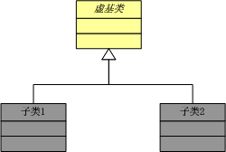

# 面向对象设计的六大原则简介

OOD基本上有6大原则，而实际上都是互补的，也就是说一些原则需要利用另一些原则来实现自己。
6大原则如下：

#### Open-Close Principle（OCP）开-闭原则
讲的是设计要对扩展有好的支持，而对修改要严格限制。这是最重要也是最为抽象的原则，基本上我们所说的Reusable Software既是基于此原则而开发的。其他的原则也是对它的实现提供了路径。

#### Liskov Substituition Principle（LSP）里氏代换原则
很严格的原则，规则是“子类必须能够替换基类，否则不应当设计为其子类。”也就是说，子类只能去扩展基类，而不是隐藏或覆盖基类，如有这方面需要的设计就应当参考以下两种方法替换：

1. 

2. 

#### Dependence Inversion Principle（DIP），依赖倒换原则
“设计要依赖于抽象而不是具体化”。换句话说就是设计的时候我们要用抽象来思考，而不是一上来就开始划分我需要哪些哪些类，因为这些是具体。这样做有什么好处呢？人的思维本身实际上就是很抽象的，我们分析问题的时候不是一下子就考虑到细节，而是很抽象的将整个问题都构思出来，所以面向抽象设计是符合人的思维的。另外这个原则会很好的支持OCP，面向抽象的设计使我们能够不必太多依赖于实现，这样扩展就成为了可能，这个原则也是另一篇文章《Design by Contract》的基石。

#### Interface Segregation Principle（ISP）将大的接口打散成多个小接口
这样做的好处很明显，我不知道有没有必要再继续描述了，为了节省篇幅，实际上我对这些原则只是做了一个小总结，如果有需要更深入了解的话推荐看《Java与模式》，MS MVP的一本巨作！^_^

#### Composition/Aggregation Reuse Principle（CARP），设计者首先应当考虑复合/聚合，而不是继承
（因为它很直观，第一印象就是“哦，这个就是OO啊”）。这个就是所谓的“Favor Composition over Inheritance”，在实践中复合/聚合会带来比继承更大的利益，所以要优先考虑。

#### Law of Demeter or Least Knowlegde Principle（LoD or LKP），迪米特法则或最少知识原则
这个原则首次在Demeter系统中得到正式运用，所以定义为迪米特法则。它讲的是“一个对象应当尽可能少的去了解其他对象”。也就是又一个关于如何松耦合（Loosely-Coupled）的法则。

好了，以上是6大原则（或法则）的介绍，对这些原则的深入研究正是如何得到设计模式的道路。在进行了深入了解后我们就可以开始看看设计模式了，设计模式正是对这些法则的应用，著名的设计模式有四人帮（Gang of Four，GoF）的23个模式，除此之外还有很多其他的一些著名模式，大家可以慢慢研究，如果能自己产出一两个模式的话那就太好了，证明你也是高手了！^_^

